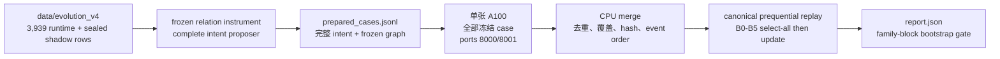

# CMD 单张 A100 实验运行手册

状态：V4 neuro-symbolic memory evolution 实验控制面已实现。本文对应
`run_remaining_experiments.sh`，同时保留旧 arena/Phase 1/SIGIL 角色。

## 1. 单卡只负责 materialization，学习仍严格串行

V4 必须保持严格 prequential 顺序。单张 A100 依次完成全部 typed-intent 执行与
shadow scoring；policy update 只在 materialization 完成后的冻结顺序上执行一次。



单卡产出的 shard 只包含 post-outcome evidence，不携带学习状态；因此耗时会增加，
但不会改变实验统计口径或 prequential 更新顺序。

## 2. 单卡角色与端口

| lane | 默认物理 GPU | Judge | Answerer | 工作 |
|---|---:|---:|---:|---|
| `v4_prepare_inputs` | `0` | `8000` | `8001` | relation cache、graph 与完整 intent 冻结 |
| `v4_single_gpu` | `0` | `8000` | `8001` | 全部 case 的 typed execution/scoring |
| `v4_gpu0` | `0` | `8000` | `8001` | hash bucket 0 的 typed execution/scoring |
| `v4_gpu1` | `1` | `8000` | `8001` | hash bucket 1 的 typed execution/scoring |
| `v4_merge` | CPU | — | — | 严格合并和八臂 replay |

当前推荐路径只设置 GPU 0：

```bash
export CMD_GPU0_ID=0
export CMD_GPU0_PORT_BASE=8000
```

role 会在这张卡上依次启动 frozen Qwen judge 和 Llama answerer，避免 KV-cache
初始化竞争。原 `v4_gpu0`/`v4_gpu1` 双卡路径保留为兼容选项。

## 3. 统一数据构建与验证

仓库内已冻结 CPU 数据包 `data/evolution_v4/`。它由 MemTrace、STALE、MemFail
共同构建，但不把三域硬拼后随机切分：MemTrace 按 user/knowledge-point，STALE 按
`-dimN` family，MemFail 按 `-qN` family；同一 dependency group 不会跨
represented/unseen。

从原始数据重建：

```bash
python -m experiments.build_v4_evolution_dataset \
  --output-dir data/evolution_v4

python -m experiments.validate_v4_evolution_dataset \
  --dataset-dir data/evolution_v4 \
  --output data/evolution_v4/validation_report.json
```

也可以只复验仓库内已构建的数据：

```bash
./run_remaining_experiments.sh --role v4_prepare --run-id v4-data-check
```

冻结统计为 3,939 cases、1,074 families、912 dependency groups、14,164
runtime-only relation requests。验证器会重算三套 source hash、逐 case source hash、
五个输出文件 hash、hidden-intent replay、retrieved-pair coverage、family isolation，
并检查 runtime 中不存在 gold/label/`M_old:`/`M_new:`。

这个 CPU 包故意标为 `relation_instrument_pending`。`relation_requests.jsonl.gz` 只能交给
冻结 text-only instrument；不能用 shadow 中的 `perturbation_label` 直接制造 positive
edge。使用新增 role 完成 GPU 输入冻结：

```bash
# 先用平衡抽取的 represented/unseen case 做准备链 smoke
./run_remaining_experiments.sh \
  --role v4_prepare_inputs --run-id v4-input-smoke-001 --smoke --detach

./run_remaining_experiments.sh \
  --role monitor --run-id v4-input-smoke-001

# smoke 通过后生成正式全集；relation SQLite cache 会复用已有 verdict
./run_remaining_experiments.sh \
  --role v4_prepare_inputs --run-id v4-input-full-001 --detach
```

该 role 在 GPU0 上依次使用 Qwen relation instrument 和 Llama complete-intent
proposer。relation 调用使用冻结 JSON Schema、最多 3 次确定性尝试，并把每次原始响应、
response hash 与 `accepted_fenced_json` / `malformed_json` / `invalid_schema` /
`transport_error` reason code 写入审计 ledger。可用
`CMD_V4_MAX_RELATION_ATTEMPTS` 覆盖尝试预算。默认 relation `uncertain` 上限仍为 5%；
超过即拒绝整次准备，但会保留 `relation_responses.jsonl` 和
`relation_measurement_report.json` 供诊断。正式协议必须在观察结果前冻结这些值。
Llama intent proposer 同样使用按当前 graph edge/item ID 动态生成的 JSON Schema；每次
malformed/schema/compiler/transport 尝试写入 `intent_responses.jsonl`，最终报告写入
`intent_proposal_report.json`。旧版自由文本 proposal cache 因 proposer version 提升而
不会复用。

3,939 个 source cases 中，3,100 个至少有一对 retrieved items，可形成 graph-bound
intent；其余 839 个只有一个 retrieved item，明确记录为
`excluded_no_relation_pair`。系统不会为它们伪造关系边或 no-op intent。

## 4. 冻结 GPU 输入契约

默认输入是：

```text
artifacts/neuro_symbolic_evolution_v4/prepared_cases.jsonl
```

可用 `CMD_V4_SOURCE_CASES` 覆盖；自定义输入时必须同时设置其对应的
`CMD_V4_PREPARATION_MANIFEST`，否则 GPU role 会在启动 endpoint 前拒绝运行。每行必须使用
`cmd-v4-live-materialization-input-v1`，且只包含以下闭合字段：

```text
schema_version
case_id / family_id / probe_set
context                 # deployment-visible PolicyContext；无 gold/family 特征
graph                   # exact FrozenRelationGraph
runtime_case            # graph hash 所绑定的 runtime-only state
intents                 # 完整 RepairIntent，不是 grammar fragment
legacy_intent_id
chain_pairs             # 有序 [A, B]；A->B 与 B->A 分开
probe_case              # 仅 live shadow evaluator 可读
```

`probe_case` 中的 gold 只在 intent 已生成、typed program 已执行后用于 judge scoring；
它不会进入 policy context、intent proposal 或当次 selection。默认 live backend 是
`experiments.v4_live_materialization:live_backend`。已经拥有完整
`cmd-v4-prequential-case-v1` outcome bundle 时，可显式改为零调用 passthrough：

```bash
export CMD_V4_MATERIALIZER_BACKEND=experiments.v4_materialization:passthrough_backend
```

`v4_single_gpu`（以及兼容的 `v4_gpu0/v4_gpu1`）会在启动 endpoint 前，以零模型调用重新执行整包
prepared-case validator。输入缺失、manifest 不匹配、hash/leakage 门禁失败、schema
非闭合、graph/runtime hash 不一致、intent 不能编译或 endpoint 未配置时，lane 会
fail closed，不会把失败伪装成负样本。

准备链工件位于：

```text
artifacts/neuro_symbolic_evolution_v4/
├── prepared_cases.jsonl
├── prepared_cases.validation.json
├── prepared_cases.smoke.jsonl
├── prepared_cases.smoke.validation.json
└── preparation/
    ├── relation_cache.sqlite
    ├── smoke/
    │   ├── instrument_manifest.json
    │   ├── relation_cache_records.jsonl
    │   ├── relation_responses.jsonl
    │   ├── relation_measurement_report.json
    │   ├── graphs.jsonl
    │   ├── intent_proposals.jsonl
    │   ├── intent_responses.jsonl
    │   ├── intent_proposal_report.json
    │   └── preparation_manifest.json
    └── full/
        └── ...同一组冻结工件
```

## 5. 一次正式运行

准备完成后，用一个新的明确 run ID 启动单卡全量 materialization：

```bash
cd /path/to/CMD_Counterfactual_Memory_Debugger

export CMD_V4_CANDIDATE_BUDGET=4
export CMD_V4_ARTIFACTS="${CMD_V4_ARTIFACTS:-$PWD/artifacts/neuro_symbolic_evolution_v4}"
RUN_ID=v4-confirm-001
mkdir -p "$CMD_V4_ARTIFACTS"

nohup ./run_remaining_experiments.sh \
  --role v4_single_gpu --run-id "$RUN_ID" --detach \
  >"$CMD_V4_ARTIFACTS/${RUN_ID}.single-gpu.launch.log" 2>&1 &
```

单卡 role 完成后运行 CPU merge/replay：

```bash
./run_remaining_experiments.sh --role v4_merge --run-id "$RUN_ID" --detach
```

正式 merge 会使用 `prepared_cases.jsonl` 的 case ID 集合检查无遗漏、无额外 case；
然后校验单 shard hash、重复 case、唯一 event index，并按
`context.event_index, case_id` 排序。

## 6. `--detach` 和 JSONL 流式监控

`--detach` 由 Python supervisor 启动新 session，不再是不可审计的裸 `nohup`。
每个 role 有一个不可复用的控制目录：

```text
artifacts/run_control/<RUN_ID>/<ROLE>/
├── launch.json          # argv、GPU、PID、日志与 status 路径
├── run.pid
├── run.log              # stdout + stderr
├── status.jsonl         # launched/running/completed/failed/stopping
└── progress.jsonl       # case 级 materialization 进度（GPU role）
```

实时聚合所有已出现的 lifecycle/progress stream：

```bash
./run_remaining_experiments.sh --role monitor --run-id "$RUN_ID"

# 只打印当前 snapshot，不 follow
./run_remaining_experiments.sh --role monitor --run-id "$RUN_ID" --once
```

查看或停止一个具体 role：

```bash
./run_remaining_experiments.sh \
  --role status --run-id "$RUN_ID" --target-role v4_single_gpu

./run_remaining_experiments.sh \
  --role stop --run-id "$RUN_ID" --target-role v4_single_gpu
```

停止使用进程组 `SIGTERM`，因此 supervisor 和它启动的 vLLM/worker 同属一个可控
边界。状态 JSONL 是事实源；`run.log` 只用于诊断。

## 7. 冒烟

GPU 冒烟只取输入前 `CMD_V4_SMOKE_CASES` 行，默认 20：

```bash
# 若尚未生成 smoke prepared 输入，先运行 §3 的 v4_prepare_inputs --smoke
RUN_ID=v4-smoke-001
./run_remaining_experiments.sh --role v4_single_gpu --run-id "$RUN_ID" --smoke --detach
./run_remaining_experiments.sh --role monitor --run-id "$RUN_ID"
```

`v4_merge --smoke` 不要求覆盖正式全集，但仍要求 shard 无重复、event index
唯一。冒烟输入必须同时含 represented 和 unseen families，否则统计 gate 会拒绝，
这是数据不足而不是代码失败。

## 8. 八个实验臂与更新时序

每个 case 使用相同 frozen candidates 和相同 candidate budget：

| Arm | 含义 | 是否更新 |
|---|---|---|
| `identity` | 零修复 | 否 |
| `legacy_symbolic` | 冻结 legacy intent | 否 |
| `random_k` | case-hash 决定的随机候选 | 否 |
| `global_policy` | 只有 global learned policy | 仅 represented |
| `hierarchical_no_chain` | niche layering + species sediment | 仅 represented |
| `full_v4` | 上述能力 + shadow repair-chain governance | 仅 represented |
| `full_v4_observable` | 与 GHOST 同 feedback 的在线残差基线 | 仅 `ghost_dev`；正式 prospective 阶段等待延迟反馈 |
| `ghost_hierarchy_v1` | pre-action evaluator + global→pattern→local GHOST | 仅 `ghost_dev`；sealed test 永不更新 |

一个 case 内的执行顺序固定为：

```text
读取 L_t
→ 八臂全部完成 selection
→ 读取各自 selected intent 的 post-outcome
→ 各臂只更新自己的 policy/repository
→ L_(t+1) 对下一 case 生效
```

所有候选 outcome 都可用于离线 oracle/headroom 诊断，但未被某 arm 选中的 outcome
不会进入该 arm 的学习。`full_v4` 的 chain 当前是 governed shadow evidence；在另有
G5 deployment authorization 之前不声称在线 store mutation 或链执行收益。
unseen family 只做 selection/scoring；其 outcome 不更新 policy、species 或 chain，
否则“held-out-family safety”会被同一评估流内的在线适配污染。

## 9. 输出与成功标准

```text
artifacts/neuro_symbolic_evolution_v4/runs/<RUN_ID>/
├── materialized/
│   ├── single_gpu.jsonl
│   └── single_gpu.jsonl.manifest.json
├── cases.merged.jsonl
├── cases.merged.jsonl.manifest.json
└── prequential/
    ├── run_manifest.json
    ├── arm_outcomes.jsonl
    ├── progress.jsonl
    ├── repositories/
    │   ├── hierarchical_no_chain.sqlite
    │   └── full_v4.sqlite
    └── report.json
```

`report.json` 包含每臂 recovery、locality、utility、selection rate、utility AULC、
represented/unseen 分层结果、repository hash、stable species/chain 计数和
family-block bootstrap gate。

能力演化 claim 只在以下条件同时成立时成立：

1. `full_v4` 相对预注册 baseline 的 represented-family utility 差值与单侧 95%
   lower bound 都大于 0；
2. unseen-family safety estimate 不为负，lower bound 不低于冻结 margin；
3. equal candidate budget、select-before-outcome、selected-action-only feedback 全部通过；
4. locality、rollback、schema/hash 和 repository replay 无拒绝。

`policy weights changed`、`repository 变大`、`出现 stable species` 或 `chain_count > 0`
本身都不是能力增长证据。

## 10. 旧实验角色

旧 `gpu0/gpu1/analyze`、`phase1_*`、`sigil_*` 和 `route_a` 仍可用，并自动获得
相同的 detached lifecycle、GPU ID 和 lane-specific 端口控制。查看完整列表：

```bash
./run_remaining_experiments.sh --help
```

V4 不会改写旧 arena JSONL，也不会用新结果重新解释 v1-v3 表格。

## 11. GHOST 后续实验

旧 GHOST V1 固定候选动作接线已经退役。新的开放世界
`failure_memory → pattern → repair_skill` 协议见
`BUILD_SPEC_GHOST_ECOLOGY_V2.md`。V2 的真实调用 runner 尚未授权；当前脚本只保留
经过验证的 V4 八臂路径，避免误用 V1 结果启动不符合新目标的实验。
