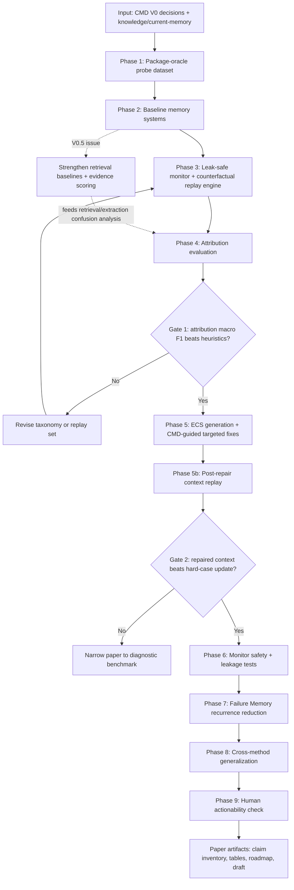

# CMD Research Plan and Roadmap

Project: **Counterfactual Memory Debugger for LLM Agent Memory**

Short name: **CMD**

Date: 2026-05-20 (last updated: Decision 30 acceleration + Rewind positioning)

## 0. Source Context and Boundary

This plan is based on:

- selected direction file in `plans/direction_01_counterfactual_memory_debugger.md`;
- full CMD plan in `plans/direction_01_research_plan.md`;
- compressed active memory in `knowledge/current-memory.md`;
- retained CMD-specific reference notes under `reference_notes/`;
- local Scientify skills and repository at `/Users/supremewen/Scientify/scientify`;
- daily metabolism notes through `log/2026-05-09.md`;
- resolved V0 decisions in `plans/cmd_open_decisions.md`.

The Feishu wiki link was provided, but its content could not be accessed here. Current plan treats it as a pending external input.

## 1. One-line Research Goal

Build **CMD-Audit**, a standalone counterfactual memory-auditing harness that diagnoses V0 memory-pipeline failures, validates repaired contexts on the original failed query, and reserves **CMD-Skill Adapter** as the later deployment interface.

## 2. Problem Statement

Long-term memory improves LLM agents, but memory systems are still hard to debug and repair. A final wrong answer does not reveal whether the root cause was a corrupted memory item, stale user memory, lossy compression, wrong retrieval, misleading graph expansion, bad evidence injection, or final reasoning misuse.

The practical consequence is that memory research often optimizes whole systems blindly. When a method improves or fails, we cannot reliably say which memory operation was responsible.

CMD reframes this as a failure-attribution, repair-validation, and memory-audit problem.

## 3. Background

Recent memory-agent work has decomposed memory into explicit operations:

- **MemSkill** treats memory extraction, consolidation, and pruning as evolvable skills.
- **AgeMem** exposes memory operations as policy actions.
- **SimpleMem** shows memory-unit construction and compression strongly affect performance.
- **BudgetMem** shows query-aware routing and budget tiers are first-class decisions.
- **Omni-SimpleMem** demonstrates failure-driven system search.
- **RepoAudit** shows validator/replay techniques can reduce false agent conclusions.
- **Storage Is Not Memory** argues that ingestion-time extraction can discard future-needed evidence, making raw-event replay necessary before blaming retrieval.
- **Governed Collaborative Memory** makes correction pathways, provenance, and version lineage central to persistent memory.
- **MEMTIER** exposes tiered retrieval and consolidation as long-running agent bottlenecks.
- **Agent memory circuit analysis** suggests operation-level memory diagnosis may have internal model signals, even though CMD remains black-box first.
- **MEMAUDIT** shows memory-writing quality can be evaluated with package-oracle style audit cases.
- **STALE** and **BeliefMem** show stale, uncertain, and conflicting memories matter, but those item-level labels should remain V1/V2 scope.
- **SafeHarbor** and **Autonomous LLM Agent Worms** show persistent memory and monitor context can become safety or leakage surfaces.
- **Cross-Component Interference** shows that adding more agent scaffolding can hurt, supporting a small standalone V0 harness.

These systems imply a missing layer: a diagnostic mechanism that can identify which operation failed.

## 4. Core Inspiration

CMD combines three ideas:

1. **Hard cases need labels:** MemSkill uses hard cases, but hard cases need operation-level failure labels before they can guide skill evolution.
2. **Failure-driven search needs taxonomy:** Omni-SimpleMem searches from failures, but CMD makes failures memory-operation-specific.
3. **Replay can validate agent internals:** RepoAudit-like validation suggests counterfactual replays can expose false intermediate assumptions.

## 5. Research Questions

RQ1. Can counterfactual replay recover the injected failure cause in controlled memory perturbations?

RQ2. Are CMD attributions more accurate and actionable than heuristic evidence-recall labels or LLM-as-judge explanations?

RQ3. Do CMD-guided targeted fixes improve memory systems more than undifferentiated hard-case updates?

RQ4. Do failure profiles differ across fixed-summary, compressed, graph, retrieve-all, and routed memory systems?

RQ5. Can Error-Cause-Solution memories reduce hallucination, conflict recurrence, and memory pollution recurrence in future similar tasks?

RQ6. Does Post-Repair Context Replay recover the original failed query better than a generic hard-case update?

RQ7. Can a leak-safe Subagent Judge Monitor trigger replay without becoming a hidden attribution, memory-writing, or trace-leak channel?

RQ8. Do MEMAUDIT-style package-oracle cases make V0 attribution and post-repair evaluation more reproducible?

RQ9. After the minimal probe runs, do stronger retrieval baselines and richer evidence metrics reduce genuine retrieval misses without hiding `premature_extraction_error` cases?

## 5.1 Why Not Just Use a Subagent Judge?

A subagent judge is useful, but it is an observational explainer rather than an interventional attribution method.

| Method | What it observes | What it can output | Main limitation |
|--------|------------------|-------------------|-----------------|
| evidence-recall heuristic | retrieved evidence overlap | coarse retrieval label | cannot separate write, compression, route, injection, graph, and reasoning failures |
| LLM/subagent judge | final answer, retrieved memory, trace text | plausible natural-language explanation | post-hoc explanation may be biased, unstable, and non-causal |
| CMD | outputs under controlled counterfactual interventions | operation-level attribution plus repair action | higher cost, but produces testable recovery evidence |

Even a strong subagent judge cannot know whether the answer would recover under oracle write, oracle compression, raw-event replay, route oracle, injection oracle, or evidence-given reasoning unless those interventions are actually executed. Multi-agent debate can improve explanation quality, but it does not by itself create counterfactual evidence.

Therefore, subagent judge should be included as a baseline and optional explanation layer:

1. **Baseline:** ask a subagent judge to label the failure from the trace.
2. **Hybrid:** let the subagent judge read CMD replay deltas and write a human-facing explanation.
3. **Not enough as main method:** do not treat free-form judge rationales as ground-truth attribution.

## 6. Hypothesis

For a failed case \((q,H,M,\hat{y},y)\), run counterfactual interventions:

\[
CF=\{cf_{write}, cf_{compress}, cf_{granularity}, cf_{route}, cf_{retrieve}, cf_{graph}, cf_{safety}, cf_{reason}\}
\]

Each intervention yields:

\[
\hat{y}_k=Agent(q,Intervention_k(M,H))
\]

Recovery gain:

\[
\Delta_k=Metric(\hat{y}_k,y)-Metric(\hat{y},y)
\]

Predicted failure cause:

\[
c^*=\arg\max_k\Delta_k
\]

If the top gains are close, CMD emits top-2 or multi-label attribution.

## 7. Failure Taxonomy

CMD first separates two broad failure families:

1. **Bad memory item**: the memory content itself is wrong, stale, conflicting, poisoned, or compression-distorted.
2. **Failed memory pipeline**: the memory item may be correct, but write, retrieval, routing, injection, graph expansion, safety filtering, or reasoning failed.

### Bad Memory Item Labels

| Label | Meaning |
|-------|---------|
| `item_wrong` | memory content is factually wrong |
| `item_stale` | memory is outdated |
| `item_conflict` | memory conflicts with another memory or evidence |
| `item_poisoned` | memory was polluted by adversarial or untrusted content |
| `item_compression_distorted` | compression changed or dropped key meaning |

### Pipeline Failure Labels

| Label | Meaning | Primary Replay |
|-------|---------|----------------|
| `write_error` | key evidence was never written | Oracle Write |
| `compression_error` | written memory lost key details during compression | Oracle Compression |
| `granularity_error` | wrong memory granularity was used | Oracle Granularity |
| `route_error` | wrong store or budget tier was selected | Oracle Route |
| `retrieval_error` | correct memory exists but was not retrieved | Oracle Retrieval |
| `premature_extraction_error` | raw event contains needed evidence, but extracted memory no longer preserves it | Verbatim Event Oracle |
| `injection_error` | correct memory was injected in a misleading or unusable form | Injection-Oracle |
| `graph_error` | graph expansion added wrong or distracting evidence | Graph-Off / Graph-Only |
| `safety_error` | safety filter falsely blocked useful evidence or admitted unsafe memory | Safety-Off / Safety-Oracle |
| `reasoning_error` | correct evidence was retrieved but final reasoning failed | Evidence-Given Reasoning |

## 8. Method Overview

### 8.1 Base Memory Pipeline

1. Build memory units from history.
2. Compress or summarize memory.
3. Route query to memory store/tier.
4. Retrieve evidence.
5. Generate final answer.
6. Score answer and evidence.

### 8.2 Runtime Monitor and Repair Loop

CMD runs as a lightweight monitor first, and only invokes expensive diagnosis when anomalies appear:

```text
Each task
  ↓
Lightweight Memory Monitor
  ↓
Anomaly detected?
  ├── No: normal execution
  └── Yes: Failure Diagnoser
          ↓
     Read wrong memory, original evidence, execution trace
          ↓
     Generate Error-Cause-Solution
          ↓
     Inject repair context:
     wrong_memory + cause + corrected_memory + repair_action
          ↓
     Correct User Memory
          ↓
     Write Error-Cause-Solution into Failure Memory
          ↓
     Future similar tasks retrieve only:
     corrected_memory + short repair guidance
```

The monitor watches for evidence-answer inconsistency, memory conflicts, stale preference use, low evidence support, suspicious graph expansion, and retrieval-answer mismatch.

### 8.3 Counterfactual Replay Engine

CMD reruns failed cases with controlled interventions:

- Oracle Write: inject gold evidence into memory.
- Oracle Compression: replace compressed memory with gold-preserving memory.
- Oracle Granularity: evaluate raw/event/session/persona/procedure/graph variants.
- Oracle Route: exhaustively test stores and budget tiers.
- Oracle Retrieval: directly provide gold evidence from the memory corpus.
- Verbatim Event Oracle: recover evidence from the raw event/session trace before extraction.
- Injection-Oracle: re-inject correct evidence in a normalized evidence block.
- Graph-Off / Graph-Only: isolate graph expansion effects.
- Safety-Off / Safety-Oracle: isolate filtering effects.
- Evidence-Given Reasoning: isolate final reasoning from memory quality.

### 8.4 Attribution Layer

Version 1 is rule-based:

\[
label=\arg\max_k\Delta_k
\]

Version 2 is learned:

\[
x=[\Delta_{write},\Delta_{compress},\Delta_{granularity},\Delta_{route},\Delta_{retrieve},\Delta_{raw\_event},\Delta_{inject},\Delta_{graph},\Delta_{safety},cost,evidence\_recall]
\]

\[
p(c|x)=softmax(Wx+b)
\]

The learned version amortizes replay cost after enough labeled replay traces exist.

### 8.5 Error-Cause-Solution Memory

CMD writes a compact repair memory:

```json
{
  "error_type": "item_conflict | retrieval_error | reasoning_error",
  "wrong_memory": "...",
  "original_evidence": "...",
  "cause": "...",
  "corrected_memory": "...",
  "repair_action": "delete | update | reroute | reformat_injection | add_disambiguation",
  "repair_guidance": "...",
  "trigger_signature": {
    "task_type": "multi-hop QA",
    "entities": ["..."],
    "memory_store": "episodic | semantic | graph"
  }
}
```

Future tasks retrieve only `corrected_memory + repair_guidance`, not the full failure trajectory.

### 8.5.1 Post-Repair Context Replay

ECS is not sufficient unless it is tested. After CMD drafts Error-Cause-Solution, V0 must rebuild the agent context and rerun the original failed query:

```text
AttributionAssigned
  -> ECSDrafted
  -> RepairedContextBuilt
  -> PostRepairRetested
  -> RepairValidated / RepairFailed
  -> FutureCaseGuided
```

The repaired context should be constructed from the diagnosis:

| Attribution | Context patch |
|-------------|---------------|
| `write_error` | add missing corrected memory |
| `compression_error` | replace distorted memory with gold-preserving corrected memory |
| `premature_extraction_error` | recover minimal raw-event evidence into memory |
| `retrieval_error` | force corrected memory into retrieved evidence set |
| `injection_error` | reformat evidence block and ordering |
| `reasoning_error` | keep evidence fixed and add repair guidance for reasoning step |

Validation constraints:

- do not inject the gold answer;
- do not expose the full failed trace;
- compare with generic hard-case update;
- report answer score, evidence score, repair success, and regression risk.

This makes CMD a repair-validated debugger, not just an attribution system.

### 8.6 Audit Module or Skill?

CMD should be framed as an **audit module first**, with a **skill interface second**.

Reason:

| Form | Role | Best for | Risk if used as the main framing |
|------|------|----------|----------------------------------|
| Audit module | external diagnostic layer over memory systems | causal attribution, benchmark, cross-system comparison, repair labels | higher runtime cost |
| Skill | reusable procedural behavior inside an agent | applying repair guidance, triggering checks, integrating with MemSkill-style evolution | may look like another prompt/procedure rather than a new diagnostic framework |

The research contribution depends on operation-level counterfactual attribution. That requires an external auditor that can rerun, ablate, and intervene on memory operations. If CMD is presented only as a skill, reviewers may read it as a prompt recipe or agent workflow, and the causal attribution claim becomes weaker.

Recommended architecture:

```text
CMD-Audit
  - Memory Monitor
  - Trace Collector
  - Counterfactual Replay Engine
  - Attribution Layer
  - ECS Generator

CMD-Skill Adapter
  - decides when to invoke CMD-Audit
  - converts ECS into repair guidance
  - injects corrected_memory + repair_guidance
  - feeds hard-case labels into skill evolution
```

Paper framing: **Counterfactual Memory Auditing for LLM Agents**.

Deployment framing: **CMD as a skillized repair adapter**.

### 8.7 Resolved V0 Design Decisions

**Decision 1: V0 starts with a smaller label set.**

V0 should not cover the full pipeline taxonomy. It should focus on labels that are easy to perturb, easy to replay, and central to the CMD claim:

```text
V0 labels:
write_error
compression_error
premature_extraction_error
retrieval_error
injection_error
reasoning_error
```

Deferred labels:

```text
granularity_error
route_error
graph_error
safety_error
```

Rationale: a first probe with 50-100 examples should maximize statistical clarity. Full-label coverage too early creates sparse classes and makes it hard to know whether failures come from CMD or from underpowered evaluation.

**Decision 2: `premature_extraction_error` is a first-class pipeline label.**

This label should appear in all primary artifacts. It is distinct from compression and retrieval: the raw event contains the needed evidence, but the extracted memory representation no longer preserves it. The primary replay is Verbatim Event Oracle.

**Decision 3: Subagent Judge is both a baseline and a cheap monitor, not the final arbiter.**

Use it in two ways:

1. baseline over the same execution trace;
2. high-recall anomaly monitor that decides whether expensive replay is worth invoking.

It should not produce final attribution or ECS unless it is reading CMD replay deltas.

**Decision 4: V0 implementation is a standalone research harness.**

Build V0 as a reproducible harness first:

```text
synthetic perturbation dataset
baseline memory systems
counterfactual replay engine
subagent/heuristic baselines
attribution metrics
ECS output schema
```

Keep adapter interfaces in the code, but defer full integration into an existing memory agent to V1. The harness is the cleanest way to prove the benchmark and attribution claims before engineering integration noise enters.

**Decision 5: MVP boundary invariants.**

V0 must encode three additional boundary rules:

1. Use `CMD-Audit` for the standalone research harness and `CMD-Skill Adapter` for later deployment.
2. Make Subagent Judge Monitor leak-safe: it may emit `trigger_replay`, `anomaly_reason`, and `confidence`, but not final labels, ECS, gold answers, full failed traces, or memory writes.
3. Exclude bad-memory-item labels from V0 attribution metrics. `item_wrong`, `item_stale`, `item_conflict`, `item_poisoned`, and `item_compression_distorted` are V1/V2 labels or ECS notes, not V0 labels.

Rationale: STALE and BeliefMem show item-level state validity matters, while SafeHarbor and Agent Worms show monitor/context re-entry can be unsafe. V0 should acknowledge these constraints without expanding the attribution task.

**Decision 6: V0 probe cases should be package-oracle-like.**

Each V0 case should specify raw events, candidate memory representations, extracted memory, gold evidence units, future-query requirements, perturbation label, expected repair action, and expected repaired context. This borrows the evaluation discipline of MEMAUDIT while keeping CMD focused on attribution and repair validation.

**Decision 7: Retrieval baseline strengthening is a V0.5 issue.**

V0 can begin with simple fixture-controlled `retrieved_memory_ids`, but the roadmap should explicitly include a follow-up issue named **Strengthen retrieval baselines and evidence scoring**.

The issue should add lexical/BM25, vector, hybrid, and hybrid+rerank retrievers; ranked retrieval traces; Recall@k, MRR, nDCG, Precision@k, context noise ratio, and answer accuracy/F1; plus hard negatives for same-entity confusion, temporal conflict, paraphrase, multi-hop evidence, stale memory, and compression-loss.

Boundary: if Verbatim Event Oracle recovers the evidence but extracted-memory oracle cannot, keep the preferred label as `premature_extraction_error`, not `retrieval_error`. A stronger retriever should not mask evidence that was never preserved in extracted memory.

## 9. Dataset Plan

### Primary Datasets

| Dataset | Role |
|---------|------|
| LoCoMo | long-term dialogue, persona/event/temporal memory |
| LongMemEval | long-context memory and retrieval evaluation |
| HotpotQA-memory variant | separates retrieval from multi-hop reasoning |
| Synthetic perturbation split | gives known failure labels for attribution evaluation |

### Perturbation Types

1. Delete gold evidence before write.
2. Compress away entity, date, or relation.
3. Discard future-needed raw evidence during ingestion-time extraction.
4. Hide recoverable memory from retrieval.
5. Inject correct memory in a misleading or badly formatted context block.
6. Provide correct evidence but weaken reasoning prompt.

Deferred perturbations:

- wrong granularity;
- wrong route/store/tier;
- graph expansion mistakes;
- safety filtering mistakes;
- stale, conflicting, poisoned, or otherwise bad memory items.

### Example Schema

```json
{
  "id": "cmd_probe_001",
  "query": "...",
  "history": ["..."],
  "memory_units": ["..."],
  "candidate_memory_representations": ["..."],
  "extracted_memory": ["..."],
  "gold_answer": "...",
  "gold_evidence_units": ["..."],
  "retrieval_trace": [],
  "retrieval_metrics": {},
  "future_query_requirements": ["..."],
  "perturbation_type": "compression_error",
  "base_output": "...",
  "counterfactual_scores": {},
  "failure_label": "compression_error",
  "error_cause_solution": {
    "wrong_memory": "...",
    "cause": "...",
    "corrected_memory": "...",
    "repair_action": "...",
    "repair_guidance": "..."
  },
  "expected_repaired_context": "...",
  "post_repair_scores": {}
}
```

## 10. Experimental Plan

### Experiment A: Attribution Recovery

Goal: test whether CMD recovers injected labels.

Baselines:

- random label;
- evidence recall heuristic;
- LLM-as-judge explanation;
- subagent-judge over execution trace;
- oracle retrieval only.

Metrics:

- attribution accuracy;
- macro F1;
- top-2 accuracy;
- actionability rating;
- fix-success rate after applying the suggested repair;
- stability under prompt/order perturbation;
- cost per diagnosis.

Retrieval-focused metrics for the V0.5 issue:

- Recall@k;
- MRR;
- nDCG;
- Precision@k;
- context noise ratio;
- answer accuracy / F1.

### Experiment B: Targeted Fix Value

Goal: test whether CMD labels improve follow-up fixes.

Protocol:

1. run baseline memory system;
2. label failures with CMD;
3. apply targeted fix by label;
4. compare with undifferentiated hard-case update.

Metrics:

- answer F1 / accuracy;
- evidence recall;
- fixed failures;
- token cost;
- label-specific improvement.

### Experiment B1: Post-Repair Context Replay

Goal: test whether the repaired context recovers the original failed query.

Protocol:

1. diagnose the failed case with CMD-Audit;
2. draft ECS;
3. build repaired context without injecting the gold answer;
4. rerun the same original query;
5. compare baseline, generic hard-case update, and CMD repaired context.

Metrics:

- post-repair answer score;
- post-repair evidence score;
- repair success rate;
- regression risk;
- token cost.

### Experiment B2: Failure Memory Recurrence Reduction

Goal: test whether ECS Failure Memory reduces future similar hallucinations.

Protocol:

1. induce a memory item error or memory pipeline failure;
2. let CMD generate ECS and write Failure Memory;
3. run similar future tasks;
4. compare no Failure Memory vs full failure-trace retrieval vs ECS guidance retrieval.

Metrics:

- hallucination rate;
- conflict recurrence rate;
- memory pollution recurrence;
- answer F1 / evidence recall;
- additional token cost.

### Experiment C: Cross-method Generalization

Memory systems:

- fixed summary memory;
- SimpleMem-style compressed memory;
- graph memory;
- retrieve-all vector memory;
- routed memory.

Metrics:

- attribution accuracy per method;
- failure distribution per method;
- correlation between failure profile and final performance.

### Experiment D: Human Actionability

Sample 50 failures and ask whether CMD attribution is plausible and actionable.

Metrics:

- human agreement;
- actionability rating;
- disagreement categories.

### Experiment E: Leak-Safe Monitor Boundary

Goal: ensure Subagent Judge Monitor can trigger replay without leaking trace or becoming an attribution source.

Metrics:

- trigger recall;
- false trigger rate;
- leakage violations;
- final-label override violations;
- memory-write violations.

### Experiment F: Retrieval Baselines And Evidence Scoring

Goal: test whether CMD attribution remains stable when retrieval is implemented with real retrievers instead of fixture-filled retrieved IDs.

Protocol:

1. run lexical/BM25, vector, hybrid, and hybrid+rerank retrievers;
2. record ranked retrieval traces for every case;
3. compute evidence ranking metrics and context noise;
4. add hard negatives for same-entity confusion, temporal conflict, paraphrase, multi-hop evidence, stale memory, and compression-loss;
5. compare attribution confusion between `retrieval_error` and `premature_extraction_error`.

Metrics:

- Recall@k;
- MRR;
- nDCG;
- Precision@k;
- context noise ratio;
- answer accuracy / F1;
- `retrieval_error` vs `premature_extraction_error` confusion rate.

Boundary test:

- raw-event oracle recovers + extracted-memory oracle fails -> label should remain `premature_extraction_error`;
- extracted-memory contains gold evidence + retriever fails to rank it into context -> label should be `retrieval_error`.

## 11. Baselines and Ablations

### Baselines

- No debugger: final-answer score only.
- Evidence-recall heuristic.
- LLM-as-judge free-form failure explanation.
- Subagent judge with access to the failed answer, retrieved memories, and redacted execution trace.
- Retrieval-only oracle.
- Single-intervention debugger.
- Generic hard-case update.
- V0.5 retrieval baselines: lexical/BM25 and vector baselines.

### Ablations

- Remove oracle write replay.
- Remove oracle compression replay.
- Remove oracle routing replay.
- Remove verbatim raw-event replay.
- Remove evidence-given reasoning replay.
- Top-1 attribution vs top-2 attribution.
- Rule-based CMD vs learned CMD.
- Remove post-repair context replay.
- Remove leak-safe monitor restrictions.

## 12. Claim Inventory Draft

This follows the Scientify write-paper principle: claims must be evidence-bound.

| Claim ID | Claim | Evidence Needed | Status |
|----------|-------|-----------------|--------|
| C1 | CMD recovers injected memory failure labels better than heuristics | Experiment A macro F1 | TODO |
| C2 | CMD-guided targeted fixes outperform undifferentiated hard-case updates | Experiment B F1/fixed failures | TODO |
| C3 | Different memory systems have distinct failure profiles | Experiment C distribution table | TODO |
| C4 | CMD explanations are useful for human debugging | Experiment D actionability rating | TODO |
| C5 | ECS Failure Memory reduces recurrence of similar memory-induced hallucinations | Experiment B2 recurrence metrics | TODO |
| C6 | Verbatim Event Oracle reduces false `retrieval_error` labels caused by ingestion-time abstraction loss | label confusion matrix before/after raw-event replay | TODO |
| C7 | CMD is more accurate and actionable than subagent-judge explanations | Experiment A attribution F1 + Experiment B fix-success + Experiment D actionability | TODO |
| C8 | Audit-module framing generalizes across memory systems better than skill-only framing | cross-system integration results + adapter ablation | TODO |
| C9 | Post-repair reconstructed context recovers the original failed query better than generic hard-case update | post-repair retest success rate and evidence score | TODO |
| C10 | Leak-safe Subagent Judge Monitor triggers replay without becoming a hidden attribution or memory-writing channel | monitor trigger recall + leakage test suite | TODO |
| C11 | MEMAUDIT-style package cases make V0 probe labels more reproducible | schema completeness and reproduction checks | TODO |
| C12 | Stronger retrieval baselines improve genuine retrieval-error analysis without masking premature extraction failures | Experiment F retrieval metrics + confusion matrix | TODO |

No claim should enter abstract/conclusion before evidence exists.

## 13. Path Map



## 14. Timeline (Accelerated — 2026-06-10 target)

Decision 30 (2026-05-20): Counterfactual replay is commoditizing from both tooling and academic directions. Timeline accelerated from 2026-06-15 to **2026-06-10 draft deadline**.

### V0 (已完成, 2026-05-09 ~ 2026-05-13)

| Week | Output | Status |
|------|--------|--------|
| 1 | package-oracle schema + 20 smoke cases | ✅ |
| 2 | 50-100 V0 probe cases + baselines | ✅ |
| 3 | replay engine + 6 replays | ✅ |
| 4 | attribution evaluation vs baselines | ✅ |
| 5 | ECS + Post-Repair Context Replay | ✅ |
| 6 | leak-safe monitor tests | ✅ |
| 7 | Failure Memory recurrence experiment | ✅ |
| 8 | V0→V1 gate check (4 criteria pass) | ✅ HITL approved |

### V1 (已完成, 2026-05-13 ~ 2026-05-19)

| Week | Output | Status |
|------|--------|--------|
| 9-10 | Issues 0011-0012: label expansion (6→11 labels, 6→10 replays) | ✅ |
| 11 | Issue 0013: coupled-failure recalibration + memory-probe baseline | ✅ |
| 12 | Issue 0014: mem0 adapter integration | ✅ |
| 13 | Issue 0015: Letta adapter + V1→V2 gate pass | ✅ |

### V1 Remaining → Paper (2026-05-20 ~ 2026-06-10)

| Date | Output | Owner |
|------|--------|-------|
| ✅ 05-22 | Real data integration + at-scale mechanics validation | engineering |
| ✅ 05-23 | Decision 33 hook implementation + Decision 34 paper-claim repair | engineering / HITL |
| 05-25~28 | LLM eval infra wiring (`agent_generate`, independent scorer, AnswerVerifier, label strip) | engineering |
| 05-28~30 | 596-case LLM re-test (all 10 replays, no hook) | engineering |
| 05-30~01 | 130-case researcher adjudication | researcher |
| 06-03 | Experiment 2 headline on 130 adjudicated cases | — |
| 06-06 | Experiment 1: 80 cases x 5 modes with token-control | — |
| 06-10 | **Paper draft complete**: adjudicated headline + Experiment 1 + layered positioning + supplementary sanity/hook/coupled-failure tables | — |

### V2 (设计完成, post-paper implementation)

Runtime repair loop, contrastive context mode, Failure Memory skill evolution. Architecture defined but implementation deferred to post-paper.

## 15. Competitive Positioning: CMD vs Generic Agent Debuggers (Rewind)

Decision 30 (2026-05-20) originally required head-to-head differentiation from generic agent debugging tools. Decision 34 (2026-05-23) drops the head-to-head benchmark because Rewind and CMD operate on different layers and do not share an input modality. Counterfactual replay is becoming table stakes — 3+ tools (Culpa, Rewind, TraceForge) + 3+ academic systems (STAR, TraceAudit, CMD) converged on "record→replay→fork→measure" within 2 months. CMD must demonstrate memory-pipeline-specific depth through layered positioning and qualitative boundary examples, not forced shared metrics.

### The Convergence Problem

| Tool | Approach | Granularity |
|------|----------|-------------|
| Culpa | Deterministic replay + counterfactual forking | Agent step |
| Rewind | Time-travel debugger, `rewind fix` command | Agent step |
| TraceForge | Counterfactual sensitivity scoring | Data input |
| STAR | Stage-attributed counterfactual repair | Pipeline stage (4) |
| TraceAudit | Chunk-level counterfactual audit | RAG chunk |
| **CMD** | Operation-level counterfactual attribution | Memory operation (11) |

### Five-Dimension Depth Differentiation (CMD vs Rewind)

| Dimension | Rewind (agent-step) | CMD (memory-operation) |
|-----------|---------------------|------------------------|
| **Granularity** | "Step 5 used stale data" | "`compression_error`: evidence lost during session 3→4 summarization, phrase 'Messi GOAT' dropped from memory item #7" |
| **Diagnosis** | LLM guesses which step failed | Counterfactual replay produces Recovery Gain ranking over 11 operations |
| **Repair** | Retry step with different model/prompt | Rewrite specific memory item to restore lost evidence (targeted per-label repair action) |
| **Validation** | LLM-as-judge score comparison | Post-Repair Context Replay: rerun original query, measure evidence recall |
| **Learning** | One-shot fix, no retention | ECS → Failure Memory → recurrence prevention via keyword retrieval |

### Decision 34 Update: Layered Positioning, No Head-to-Head

The paper no longer includes a direct benchmark against Rewind. Rewind lives at the runtime layer (agent trace, tool calls, step retry); CMD lives at the memory-pipeline layer (write/compress/extract/retrieve/inject/route/reason). The paper uses a layered-stack section instead: Runtime debugger (Rewind/Culpa/TraceForge) vs Memory debugger (CMD) vs Item-content repair (MemRepair/MemLineage), with qualitative boundary examples.

### Repair Depth Metric (Proposed)

A new metric to operationalize "deeper repair":
- **Level 0 (Symptom)**: Retry the final step (Rewind-style)
- **Level 1 (Pipeline)**: Fix the specific memory operation (CMD-style, 11 labels)
- **Level 2 (Item)**: Fix the specific memory item content (CMD-style, targeted repair)
- **Level 3 (Cascade)**: Fix the item + all downstream items affected (CMD V2, MEMOREPAIR integration)

CMD V1 achieves Level 1-2. CMD V2 targets Level 3. Rewind achieves Level 0.

### Integration Stance

CMD-Audit is a standalone harness — it does not depend on Culpa/Rewind for operation. But the paper acknowledges them as complementary infrastructure: Rewind captures the agent trace; CMD replays it at memory-operation granularity. The paper cites the counterfactual tooling convergence as validation of the methodology while demonstrating CMD's unique depth.

## 16. Implementation Artifacts

Suggested project structure:

```text
project/
  cmd/
    schema.py
    perturbations.py
    package_oracle.py
    memory_baselines.py
    retrievers.py
    retrieval_trace.py
    replay_engine.py
    monitor.py
    subagent_monitor.py
    monitor_safety.py
    attribution.py
    ecs_memory.py
    context_builder.py
    repair_replay.py
    audit_module.py
    skill_adapter.py
    metrics.py
    run_probe.py
  data/
    cmd_probe/
    cmd_probe/hard_negative_suite.jsonl
  results/
    attribution_table.csv
    retrieval_trace.csv
    retrieval_metrics.csv
    post_repair_retest.csv
    monitor_safety_report.csv
    failure_profiles.csv
    targeted_fix_results.csv
```

## 17. Risks

| Risk | Mitigation |
|------|------------|
| replay cost too high | RPE pre-filter (Issue 0016): evidence-surprise scoring selects top-k replays; D-MEM 80% token reduction target |
| failure causes are coupled | emit top-2 or multi-label attribution; configurable `top_k` (default 2); transparent `close_deltas` |
| gold evidence unavailable online | document as information-theoretic bound (Limitation #1, `cmd_innovation_core/plans/limitations.md`); two-tier deployment: CMD-Audit (offline, full) vs CMD-Skill Adapter (online, 7/11 + self-supervision) |
| LLM judge instability | prioritize exact/F1/evidence recall |
| Failure Memory pollutes context | retrieve only corrected memory and short repair guidance |
| Subagent monitor leaks trace or gold answer | restrict monitor outputs and test leakage explicitly |
| counterfactual replay commoditized before paper | Decision 30: accelerate timeline (06-10); Decision 34: emphasize layered memory-pipeline depth over generic replay; no forced Rewind benchmark |
| reviewer dismisses CMD as "just another replay tool" | paper must differentiate along granularity (operation-level, unique), evidence type (causal replay vs observational), and repair depth (Level 1-2 vs Level 0); cite Rewind/Culpa as complementary infrastructure, not competitors |
| package schema becomes too elaborate | start with 20 smoke cases before 50-100 cases |
| method becomes too engineering-heavy | first paper focuses on formulation, taxonomy, benchmark, and diagnostic value |
| stronger retrievers blur extraction vs retrieval failures | preserve the raw-event-oracle priority rule for `premature_extraction_error` |
| reviewer challenges gold evidence gap as fatal | preempt with honest limitation positioning: 4/11 labels affected (content-absence diagnosis), 7/11 unaffected (structure/access diagnosis); gap is measurable, bounded, and improves with success-trace corpus; comparison is CMD-online vs status quo (zero attribution), not CMD vs CMD-with-gold |

## 18. Current State & Next Actions

V0 complete and locked; V1 implementation layer complete through issues 0011-0021; 803 tests pass. V0→V1 and V1→V2 gates passed mechanics validation, but Decision 34 reframes the 596-case Macro F1 as a phrase-match sanity snapshot. Paper headline awaits LLM eval wiring and 130-case researcher adjudication.

### Immediate (Decision 34, 2026-05-25 ~ 2026-06-03)

1. **LLM eval infra wiring** — `agent_generate`, independent scorer, AnswerVerifier, label-strip, baseline rescore
2. **596-case LLM re-test** — all 10 replays, no hook; produces scale sanity + hook training labels
3. **Researcher 130-case adjudication** — headline Experiment 2 labels with confidence
4. **Researcher 80-ECS inspection** — Experiment 1 input quality control

### Paper sprint (2026-06-01 ~ 2026-06-10)

5. **Experiment 2**: CMD attribution effectiveness on 130 researcher-adjudicated cases
6. **Experiment 1**: 5-mode Context Construction on 80 cases with token-control
7. **Supplementary**: hook efficacy table + coupled-failure subset report + 596-case scale sanity
8. **Paper draft**: adjudicated headline claims + Experiment 1 + layered positioning

## 19. Follow-up Issues (V2)

- **Cascade repair**: MemQ TD(λ) on provenance DAG for downstream impact tracking
- **Contrastive context mode**: `wrong_memory + cause + corrected_memory` vs `corrected_memory` only
- **Repair depth metric**: Level 0 (symptom) → Level 3 (cascade) measurement framework
- **Failure Memory skill evolution**: automated ECS-driven memory policy updates
