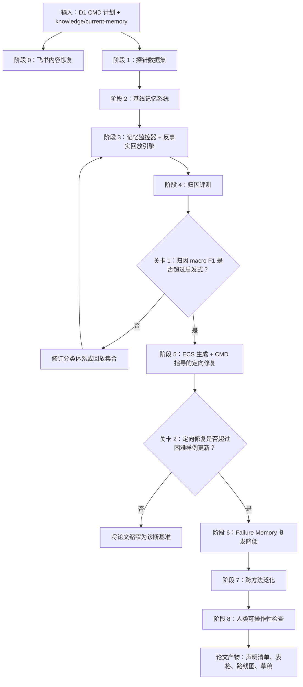

# CMD 研究计划与路线图

项目：**面向 LLM Agent 记忆的反事实记忆调试器**

简称：**CMD**

日期：2026-05-07；最近增补：2026-05-09

## 0. 来源上下文与边界

本计划基于：

- `plans/direction_01_counterfactual_memory_debugger.md` 中选定的方向文件；
- `plans/direction_01_research_plan.md` 中完整的 CMD 计划；
- `knowledge/current-memory.md` 中压缩后的当前活跃记忆；
- `reference_notes/` 中保留的 CMD 相关论文笔记；
- 本地 Scientify skills，以及位于 `/Users/supremewen/Scientify/scientify` 的仓库；
- `plans/cmd_open_decisions.md` 中的 V0 已决策边界。

飞书 wiki 链接已经提供，但这里无法访问其中内容。当前计划将其视为待补充的外部输入。

## 1. 一句话研究目标

构建 **CMD**：一个反事实回放框架，用于诊断 LLM Agent 的记忆失败究竟来自错误的记忆条目，还是失败的记忆流水线；随后存储可复用的 Error-Cause-Solution 指导，以减少未来由记忆诱发的幻觉。

## 2. 问题陈述

长期记忆可以提升 LLM Agent，但记忆系统仍然很难调试和修复。最终错误答案本身无法说明根因到底是损坏的记忆条目、过期的用户记忆、有损压缩、错误检索、误导性的图扩展、糟糕的证据注入，还是最终推理误用。

其实际后果是，记忆研究经常只能盲目优化整个系统。当某个方法提升或失败时，我们无法可靠地说出究竟是哪一个记忆操作负有责任。

CMD 将这个问题重新表述为失败归因与修复记忆问题。

## 3. 背景

近期的记忆 Agent 工作已经将记忆拆解为显式操作：

- **MemSkill** 将记忆抽取、整合和剪枝视为可演化技能。
- **AgeMem** 将记忆操作暴露为策略动作。
- **SimpleMem** 表明记忆单元构建与压缩会强烈影响性能。
- **BudgetMem** 表明查询感知路由与预算层级是一等决策。
- **Omni-SimpleMem** 展示了失败驱动的系统搜索。
- **RepoAudit** 表明验证器/回放技术可以减少 Agent 的错误结论。
- **Storage Is Not Memory** 认为，摄入阶段的抽取可能丢弃未来所需证据，因此在归咎于检索之前，必须支持原始事件回放。
- **Governed Collaborative Memory** 将纠错路径、来源追踪和版本谱系作为持久记忆的核心。
- **MEMTIER** 暴露了分层检索与整合作为长期运行 Agent 的瓶颈。
- **Agent memory circuit analysis** 暗示，操作级记忆诊断可能存在模型内部信号，尽管 CMD 首先保持黑盒方法。

这些系统共同暗示了一个缺失层：能够识别哪个操作失败的诊断机制。

## 4. 核心灵感

CMD 结合三个想法：

1. **困难样例需要标签：** MemSkill 使用困难样例，但困难样例必须先拥有操作级失败标签，才能指导技能演化。
2. **失败驱动搜索需要分类体系：** Omni-SimpleMem 从失败中搜索，而 CMD 让失败变得记忆操作特定。
3. **回放可以验证 Agent 内部过程：** 类 RepoAudit 的验证表明，反事实回放可以暴露错误的中间假设。

## 5. 研究问题

RQ1. 反事实回放能否在受控记忆扰动中恢复被注入的失败原因？

RQ2. 相比启发式证据召回标签或 LLM-as-judge 解释，CMD 的归因是否更准确、更可操作？

RQ3. CMD 指导的定向修复是否比不区分原因的困难样例更新更能提升记忆系统？

RQ4. 固定摘要、压缩、图、全量检索和路由式记忆系统之间的失败画像是否不同？

RQ5. Error-Cause-Solution 记忆能否减少未来相似任务中的幻觉、冲突复发和记忆污染复发？

## 6. 假设

对于一个失败样例 \((q,H,M,\hat{y},y)\)，运行反事实干预：

\[
CF=\{cf_{write}, cf_{compress}, cf_{granularity}, cf_{route}, cf_{retrieve}, cf_{graph}, cf_{safety}, cf_{reason}\}
\]

每个干预产生：

\[
\hat{y}_k=Agent(q,Intervention_k(M,H))
\]

恢复增益：

\[
\Delta_k=Metric(\hat{y}_k,y)-Metric(\hat{y},y)
\]

预测失败原因：

\[
c^*=\arg\max_k\Delta_k
\]

如果最高增益之间差距很小，CMD 输出 top-2 或多标签归因。

## 7. 失败分类体系

CMD 首先区分两大失败家族：

1. **错误的记忆条目**：记忆内容本身错误、过期、冲突、被污染，或因压缩而失真。
2. **失败的记忆流水线**：记忆条目可能是正确的，但写入、检索、路由、注入、图扩展、安全过滤或推理失败。

### 错误记忆条目标签

| 标签 | 含义 |
|-------|---------|
| `item_wrong` | 记忆内容在事实上错误 |
| `item_stale` | 记忆已经过期 |
| `item_conflict` | 记忆与另一条记忆或证据冲突 |
| `item_poisoned` | 记忆被对抗性或不可信内容污染 |
| `item_compression_distorted` | 压缩改变或丢弃了关键含义 |

### 流水线失败标签

| 标签 | 含义 | 主要回放 |
|-------|---------|----------------|
| `write_error` | 关键证据从未被写入 | Oracle Write |
| `compression_error` | 已写入记忆在压缩中丢失关键细节 | Oracle Compression |
| `granularity_error` | 使用了错误的记忆粒度 | Oracle Granularity |
| `route_error` | 选择了错误的存储区或预算层级 | Oracle Route |
| `retrieval_error` | 正确记忆存在，但没有被检索到 | Oracle Retrieval |
| `premature_extraction_error` | 原始事件包含所需证据，但抽取后的记忆不再保留它 | Verbatim Event Oracle |
| `injection_error` | 正确记忆被注入为误导性或不可用的形式 | Injection-Oracle |
| `graph_error` | 图扩展加入了错误或分散注意力的证据 | Graph-Off / Graph-Only |
| `safety_error` | 安全过滤错误地屏蔽了有用证据，或放入了不安全记忆 | Safety-Off / Safety-Oracle |
| `reasoning_error` | 正确证据已经被检索，但最终推理失败 | Evidence-Given Reasoning |

## 8. 方法概览

### 8.1 基础记忆流水线

1. 从历史中构建记忆单元。
2. 压缩或摘要化记忆。
3. 将查询路由到记忆存储区/层级。
4. 检索证据。
5. 生成最终答案。
6. 评分答案与证据。

### 8.2 运行时监控器与修复循环

CMD 首先作为轻量级监控器运行，只有在异常出现时才调用昂贵的诊断：

```text
每个任务
  ↓
轻量级记忆监控器
  ↓
检测到异常？
  ├── 否：正常执行
  └── 是：失败诊断器
          ↓
     读取错误记忆、原始证据、执行轨迹
          ↓
     生成 Error-Cause-Solution
          ↓
     注入修复上下文：
     wrong_memory + cause + corrected_memory + repair_action
          ↓
     修正用户记忆
          ↓
     将 Error-Cause-Solution 写入失败记忆
          ↓
     未来相似任务只检索：
     corrected_memory + short repair guidance
```

监控器关注证据-答案不一致、记忆冲突、过期偏好使用、低证据支持、可疑图扩展，以及检索-答案不匹配。

### 8.3 反事实回放引擎

CMD 使用受控干预重新运行失败样例：

- Oracle Write：将金标准证据注入记忆。
- Oracle Compression：用保留金标准的记忆替换压缩记忆。
- Oracle Granularity：评估原始/event/session/persona/procedure/graph 变体。
- Oracle Route：穷举测试存储区和预算层级。
- Oracle Retrieval：直接从记忆语料库提供金标准证据。
- Verbatim Event Oracle：在抽取之前，从原始事件/session 轨迹中恢复证据。
- Injection-Oracle：以标准化证据块重新注入正确证据。
- Graph-Off / Graph-Only：隔离图扩展效果。
- Safety-Off / Safety-Oracle：隔离过滤效果。
- Evidence-Given Reasoning：将最终推理与记忆质量隔离开。

### 8.4 归因层

版本 1 是基于规则的：

\[
label=\arg\max_k\Delta_k
\]

版本 2 是学习式的：

\[
x=[\Delta_{write},\Delta_{compress},\Delta_{granularity},\Delta_{route},\Delta_{retrieve},\Delta_{raw\_event},\Delta_{inject},\Delta_{graph},\Delta_{safety},cost,evidence\_recall]
\]

\[
p(c|x)=softmax(Wx+b)
\]

在积累足够多带标签的回放轨迹之后，学习式版本可以摊销回放成本。

### 8.5 Error-Cause-Solution 记忆

CMD 写入一条紧凑的修复记忆：

```json
{
  "error_type": "item_conflict | retrieval_error | reasoning_error",
  "wrong_memory": "...",
  "original_evidence": "...",
  "cause": "...",
  "corrected_memory": "...",
  "repair_action": "delete | update | reroute | reformat_injection | add_disambiguation",
  "repair_guidance": "...",
  "trigger_signature": {
    "task_type": "multi-hop QA",
    "entities": ["..."],
    "memory_store": "episodic | semantic | graph"
  }
}
```

未来任务只检索 `corrected_memory + repair_guidance`，而不是完整失败轨迹。

## 9. 数据集计划

### 主要数据集

| 数据集 | 角色 |
|---------|------|
| LoCoMo | 长期对话、persona/event/temporal memory |
| LongMemEval | 长上下文记忆与检索评测 |
| HotpotQA-memory variant | 分离检索与多跳推理 |
| Synthetic perturbation split | 为归因评测提供已知失败标签 |

### 扰动类型

1. 在写入前删除金标准证据。
2. 通过压缩丢失实体、日期或关系。
3. 以错误粒度存储证据。
4. 强制走错误的存储区/层级路由。
5. 添加语义相似的干扰记忆。
6. 添加错误图边。
7. 应用假阳性的安全过滤。
8. 提供正确证据，但削弱推理提示词。
9. 注入过期、冲突、被污染或压缩失真的记忆条目。
10. 在误导性或格式糟糕的上下文块中注入正确记忆。
11. 在摄入阶段抽取时丢弃未来所需的原始证据。

### 示例 Schema

```json
{
  "id": "cmd_probe_001",
  "query": "...",
  "history": ["..."],
  "memory_units": ["..."],
  "gold_answer": "...",
  "gold_evidence_units": ["..."],
  "retrieval_trace": [],
  "retrieval_metrics": {},
  "perturbation_type": "compression_error",
  "base_output": "...",
  "counterfactual_scores": {},
  "failure_label": "compression_error",
  "error_cause_solution": {
    "wrong_memory": "...",
    "cause": "...",
    "corrected_memory": "...",
    "repair_action": "...",
    "repair_guidance": "..."
  }
}
```

## 10. 实验计划

### 实验 A：归因恢复

目标：测试 CMD 是否能恢复被注入的标签。

基线：

- 随机标签；
- 证据召回启发式；
- LLM-as-judge 解释；
- 仅 oracle 检索。

指标：

- 归因准确率；
- macro F1；
- top-2 准确率；
- 每次诊断成本。

### 实验 B：定向修复价值

目标：测试 CMD 标签是否能改进后续修复。

协议：

1. 运行基线记忆系统；
2. 使用 CMD 标注失败；
3. 按标签应用定向修复；
4. 与不区分原因的困难样例更新比较。

指标：

- 答案 F1 / 准确率；
- 证据召回；
- 被修复的失败数；
- token 成本；
- 按标签分解的提升。

### 实验 B2：失败记忆的复发降低

目标：测试 ECS Failure Memory 是否减少未来相似幻觉。

协议：

1. 诱发一个记忆条目错误或记忆流水线失败；
2. 让 CMD 生成 ECS 并写入 Failure Memory；
3. 运行未来相似任务；
4. 比较无 Failure Memory、完整失败轨迹检索、ECS 指导检索。

指标：

- 幻觉率；
- 冲突复发率；
- 记忆污染复发；
- 答案 F1 / 证据召回；
- 额外 token 成本。

### 实验 C：跨方法泛化

记忆系统：

- 固定摘要记忆；
- SimpleMem 风格压缩记忆；
- 图记忆；
- 全量检索向量记忆；
- 路由式记忆。

指标：

- 每种方法的归因准确率；
- 每种方法的失败分布；
- 失败画像与最终性能之间的相关性。

### 实验 D：人类可操作性

抽样 50 个失败，询问 CMD 归因是否合理且可操作。

指标：

- 人类一致性；
- 可操作性评分；
- 分歧类别。

## 11. 基线与消融

### 基线

- 无调试器：仅最终答案分数。
- 证据召回启发式。
- LLM-as-judge 自由形式失败解释。
- 仅检索 oracle。
- 单干预调试器。

### 消融

- 移除 oracle write 回放。
- 移除 oracle compression 回放。
- 移除 oracle routing 回放。
- 移除逐字原始事件回放。
- 移除 evidence-given reasoning 回放。
- Top-1 归因 vs top-2 归因。
- 基于规则的 CMD vs 学习式 CMD。

## 12. 声明清单草案

这遵循 Scientify 的 write-paper 原则：声明必须绑定证据。

| 声明 ID | 声明 | 所需证据 | 状态 |
|----------|-------|-----------------|--------|
| C1 | CMD 比启发式方法更好地恢复注入的记忆失败标签 | 实验 A macro F1 | TODO |
| C2 | CMD 指导的定向修复优于不区分原因的困难样例更新 | 实验 B F1 / 被修复失败数 | TODO |
| C3 | 不同记忆系统具有不同失败画像 | 实验 C 分布表 | TODO |
| C4 | CMD 解释对人类调试有用 | 实验 D 可操作性评分 | TODO |
| C5 | ECS Failure Memory 减少相似记忆诱发幻觉的复发 | 实验 B2 复发指标 | TODO |
| C6 | Verbatim Event Oracle 减少由摄入阶段抽象损失导致的错误 `retrieval_error` 标签 | 原始事件回放前/后的标签混淆矩阵 | TODO |

在证据存在之前，任何声明都不应进入摘要/结论。

## 13. 路径图



## 14. 时间线

| 周 | 产出 | 关卡 |
|------|--------|------|
| 1 | `data/cmd_probe/*.jsonl`，固定摘要/向量基线 | 50-100 个带标签扰动 |
| 2 | 包含 oracle write/retrieval/compression/raw-event/reasoning 的回放引擎 | 生成回放表 |
| 3 | 与基线对比的归因评测 | macro F1 与 top-2 准确率 |
| 4 | 定向修复实验 | CMD 指导修复 vs 困难样例更新 |
| 5 | ECS Failure Memory 实验 | 复发降低表 |
| 6 | 跨方法泛化 | 失败画像表 |
| 7 | 论文就绪产物 | 声明清单与草稿大纲 |

## 15. 实现产物

建议项目结构：

```text
project/
  cmd/
    schema.py
    perturbations.py
    memory_baselines.py
    replay_engine.py
    monitor.py
    attribution.py
    ecs_memory.py
    metrics.py
    run_probe.py
  data/
    cmd_probe/
  results/
    attribution_table.csv
    failure_profiles.csv
    targeted_fix_results.csv
```

## 16. 风险

| 风险 | 缓解 |
|------|------------|
| 回放成本过高 | 从小型探针开始，然后学习归因分类器 |
| 失败原因相互耦合 | 输出 top-2 或多标签归因 |
| 缺少金标准证据 | 从合成扰动开始 |
| LLM judge 不稳定 | 优先使用 exact/F1/evidence recall |
| Failure Memory 污染上下文 | 只检索修正后的记忆和短修复指导 |
| 方法变得过度工程化 | 第一篇论文聚焦于问题形式化、分类体系、基准和诊断价值 |

## 17. 下一步行动

构建一个最小 CMD 探针：

1. 创建 50-100 个合成样例；
2. 实现固定摘要和向量记忆基线；
3. 实现 oracle write、oracle retrieval、oracle compression、oracle route、evidence-given reasoning；
4. 实现用于原始事件回放的 Verbatim Event Oracle；
5. 计算 \(\Delta_k\)；
6. 产出第一版 `attribution_table.csv`；
7. 添加 ECS schema 和面向未来相似任务的 Failure Memory 检索。

## 18. 2026-05-09 增补：检索基线与证据评分 Issue

第一版 V0 保持简单是合理的：可以先使用 fixture 控制的 `retrieved_memory_ids`，让 package-oracle、counterfactual replay、attribution table、ECS 和 Post-Repair Context Replay 跑通。

但后续应明确加入 V0.5 issue：**Strengthen retrieval baselines and evidence scoring**。

该 issue 需要补充：

- 真实 baseline retrievers：lexical/BM25、vector、hybrid、hybrid+rerank；
- ranked retrieval trace：`memory_id`、`rank`、`score`、`token_cost`、`retrieved_text`、`matched_gold_evidence_units`；
- 证据指标：Recall@k、MRR、nDCG、Precision@k、context noise ratio、answer accuracy/F1；
- hard negatives：同实体混淆、时间冲突、paraphrase、多跳证据、stale memory、compression-loss。

关键边界：当 raw-event oracle 能恢复证据，但 extracted-memory oracle 不能恢复时，应优先标成 `premature_extraction_error`，而不是被更强 retriever 误归为 `retrieval_error`。因为如果抽取后的 memory representation 从未保留未来所需证据，retriever 没有可检索对象。
