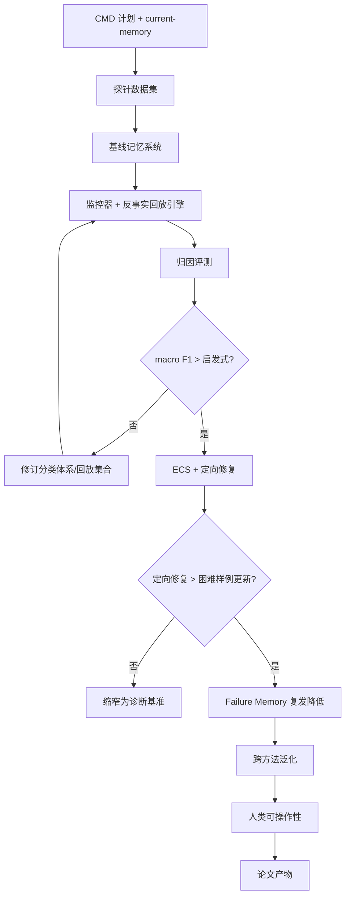

# CMD 研究计划与路线图

项目：**面向 LLM Agent 记忆的反事实记忆调试器**

简称：**CMD**

日期：2026-05-07；最近增补：2026-05-19

## 0. 来源上下文

基于 `direction_01_research_plan.md`、`current-memory.md`、`reference_notes/`、`cmd_open_decisions.md`。飞书 wiki 待补充。

## 1. 研究目标

构建 **CMD**：反事实回放框架，诊断 LLM Agent 记忆失败来自错误记忆条目还是失败流水线操作；存储 Error-Cause-Solution 以减少未来记忆诱发幻觉。

## 2. 问题陈述

长期记忆提升 LLM Agent，但记忆系统难调试：最终错误答案无法说明根因是损坏条目、过期记忆、有损压缩、错误检索、误导图扩展、糟糕注入，还是推理误用。CMD 将问题重新表述为失败归因与修复。

## 3. 背景

近期工作已将记忆拆解为显式操作（MemSkill/AgeMem/SimpleMem/BudgetMem/Omni-SimpleMem/RepoAudit/Storage Is Not Memory/MEMTIER），共同暗示缺失层：操作级失败诊断机制。

## 4. 核心灵感

1. 困难样例需操作级失败标签才能指导技能演化（MemSkill）
2. 失败驱动搜索需分类体系（Omni-SimpleMem → CMD 让失败变为记忆操作特定）
3. 回放验证 Agent 内部过程（RepoAudit → counterfactual replay）

## 5. 研究问题

- RQ1: 反事实回放能否在受控扰动中恢复注入的失败原因？
- RQ2: CMD 归因 vs 启发式证据召回/LLM-as-judge 解释？
- RQ3: CMD 定向修复 vs 不区分原因的困难样例更新？
- RQ4: 不同记忆系统（摘要/压缩/图/全量检索/路由式）失败画像是否不同？
- RQ5: ECS Failure Memory 能否减少未来相似幻觉/冲突/污染复发？

## 6. 核心假设

对失败样例运行反事实干预，测量 Recovery Gain Δk = Metric(ŷ_k, y) - Metric(ŷ, y)，归因 label = argmax(Δk)。top-2 或多标签归因（当增益接近时）。

## 7. 失败分类体系

两大失败家族：错误记忆条目（`item_wrong`/`item_stale`/`item_conflict`/`item_poisoned`/`item_compression_distorted`，V2）和失败流水线（10 个 pipeline label）。V0 仅 6 个：`write_error`/`compression_error`/`premature_extraction_error`/`retrieval_error`/`injection_error`/`reasoning_error`。V1 扩展 5 个：`ingestion_error`/`route_error`/`granularity_error`/`graph_error`/`safety_error`。详见 CONTEXT.md。

## 8. 方法概览

### 8.1 基础流水线

构建记忆单元 → 压缩/摘要 → 路由到存储区/层级 → 检索证据 → 生成答案 → 评分。

### 8.2 运行时监控器与修复循环

轻量级监控器仅在异常时触发诊断 → Counterfactual Replay → ECS → Post-Repair Context Replay → 修正用户记忆 → 写入 Failure Memory。未来相似任务只检索 `corrected_memory + repair_guidance`。

### 8.3 反事实回放引擎

10 个受控干预：Oracle Write/Compression/Granularity/Route/Retrieval、Verbatim Event Oracle、Injection-Oracle、Graph-Off/Only、Safety-Off/Oracle、Evidence-Given Reasoning。V0 实现前 6 个。

### 8.4 归因层

V1 基于规则（argmax Δk），V2 学习式（softmax 分类器，积累足够带标签回放轨迹后摊销成本）。

### 8.5 ECS 记忆

紧凑结构化记录：error_type、wrong_memory、cause、corrected_memory、repair_action、repair_guidance、trigger_signature。未来任务仅检索 corrected_memory + repair_guidance。

## 9. 数据集计划

**主要数据源**: LoCoMo（长期对话）、LongMemEval（长上下文记忆QA）、HotpotQA-memory variant（多跳推理+检索分离）、Synthetic perturbation split（已知失败标签）。

**11 种扰动类型**: 删除金标准证据、压缩丢失实体/日期/关系、错误粒度存储、错误路由、语义相似干扰、错误图边、假阳性安全过滤、削弱推理提示词、注入过期/冲突/污染/失真条目、注入格式糟糕的正确记忆、摄入阶段丢弃原始证据。

**两个实验的数据集**（2026-05-12 增补，详见 Decision 18）：

- **Experiment 2: Probe Cases** — `perturbation_type` 为注入 ground truth，每 label 8-10 个 case，V0 50-100（6 labels × 8-16），V1 100-150。格式见 `data/probe_cases/` 现有 smoke cases。
- **Experiment 1: 4-Mode Context Cases** — 被试内设计，4 种预拼接 contexts（none/full_trace/corrected_only/contrastive），从 CMD ECS 产物构建。`none` 必须失败。最少 15-20 个，理想 30-40 个。

**构建顺序**: Probe Cases → CMD pipeline → ECS records → Context Cases（约束：Context Cases 依赖 ECS 字段）。10-case 最小模板可同时服务两个实验。

**数据集参考**: MEMAUDIT (package-oracle)、Memory-Probe (3×3 grid)、MemEvoBench (risk-type taxonomy)、ErrorProbe (step-level injection)、MedEinst (counterfactual hierarchy)。原始数据改编源：LoCoMo/LongMemEval/HotpotQA。

## 10. 实验计划

- **实验 A（归因恢复）**: CMD vs 随机/证据召回/LLM-as-judge/仅检索 oracle。指标：macro F1、top-2 accuracy、每诊断成本。
- **实验 B（定向修复价值）**: 按 label 定向修复 vs 不区分原因的困难样例更新。指标：答案 F1、证据召回、被修复失败数。
- **实验 B2（Failure Memory 复发降低）**: 比较无 Failure Memory / 完整失败轨迹 / ECS 指导检索。指标：幻觉率、冲突复发、污染复发。
- **实验 C（跨方法泛化）**: 5 种记忆系统（摘要/压缩/图/全量检索/路由式）。指标：失败分布、归因准确率。
- **实验 D（人类可操作性）**: 50 个失败人工评分。指标：一致性、可操作性。

## 11. 基线与消融

**基线**: 无调试器、证据召回启发式、LLM-as-judge、仅检索 oracle、单干预调试器。

**消融**: 依次移除各 oracle 回放、top-1 vs top-2、基于规则 vs 学习式。

## 12. 声明清单（V0+V1+V2 完整版）

| ID | 声明 | 阶段 | 证据 | 状态 |
|----|------|------|------|------|
| C0 | 失败归因是 agent memory 新兴子领域，CMD 是唯一 operation-level 反事实方法 | V0→V1 | Day 5 竞争格局（5+ 方法对比表） | ✅ evidenced |
| C1 | CMD 恢复注入标签优于启发式 | V0 | 实验 A macro F1 | TODO |
| C2 | CMD 定向修复 > 不区分原因更新 | V0 | 实验 B F1 | TODO |
| C3 | 不同记忆系统失败画像不同 | V0 | 实验 C 分布表 | TODO |
| C4 | CMD 解释对人类调试有用 | V0 | 实验 D 可操作性 | TODO |
| C5 | ECS Failure Memory 减少复发 | V0 | 实验 B2 复发指标 | TODO |
| C6 | Verbatim Event Oracle 减少错误 retrieval_error | V0 | 混淆矩阵 | TODO |
| C7 | 5 新 label 不降低原 6 label macro F1 | V1 | 11-label 混淆矩阵 | TODO |
| C8 | mem0 上归因准确率不低于 standalone harness | V1 | macro F1 对比 | TODO |
| C9 | 跨 ≥2 agent 泛化不退化 | V1→V2 | mem0+Letta 报告 | TODO |
| C10 | RPE 降低 ≥50% 成本，保持 recall | V1 后期 | cost-recall 曲线 | TODO |
| C11 | 运行时修复闭环 | V2 | 端到端 repair→recovery | TODO |

## 13. 路径图

## 14. 时间线（V0→V1→V2）

| 阶段 | 产出 | 关卡 |
|------|------|------|
| V0 已完成 | Issues 0001-0010，218 tests pass | — |
| V0 待完成 | Probe suite scaling: 6→50-100 | V0→V1 gate: 4 项 artifact 规模化验证 |
| V1 前期 | `ingestion_error`+`route_error`，mem0 adapter | 8-label F1 ≥ V0 6-label |
| V1 中期 | `granularity_error`+`graph_error`+`safety_error`，Letta adapter | 11-label 双 agent F1 不退化 |
| V1 后期 | 真实数据 probe，RPE pre-filter | cost-recall trade-off |
| 任意时间 | 4-Mode Context Experiment（现有产物+真实 LLM）| 为 V2 contrastive mode 提供早期证据 |
| V2 | 运行时修复闭环，contrastive mode | 端到端验证 |
| 论文 | 声明清单通过，草稿完成 | — |

## 15. 风险

| 风险 | 缓解 |
|------|------|
| 回放成本过高 | 小型探针起步，学习式分类器摊销 |
| 失败原因耦合 | top-2 / 多标签归因 |
| 缺少金标准证据 | 合成扰动起步 |
| LLM judge 不稳定 | 优先 exact/F1/evidence recall |
| Failure Memory 污染 | 仅检索 corrected_memory + repair_guidance |
| 过度工程化 | 首篇论文聚焦诊断基准 |
| **归因子领域拥挤（新增）** | 加速时间线至 6 月中旬；论文必须显式与 5 种新归因方法差异化；强调 operation-level + counterfactual intervention + Post-Repair quality gate 三重差异 |
| **直接竞争者出现（新增）** | 2605.13077 已使用反事实推理做 agent-level 归因；若其扩展到 operation-level，CMD 首发优势消失。缓解：加速 + 明确差异化论证 |

## 19. V0→V1→V2 路线图增补（2026-05-11 ~ 2026-05-13）

### 19.1 论文范围与架构

V0 + V1 + V2 = 一篇论文。V2 为最终 module/skill。故事线：受控归因 (V0) → 跨系统泛化 (V1) → 运行时修复闭环 (V2)。V0→V1/V1→V2 gate 为内部 checkpoint。详见 Decision 15。

### 19.2 V1 标签扩展

优先级：`ingestion_error` → `route_error` → `granularity_error` → `graph_error` → `safety_error`。Bad item labels 延后到 V2。详见 Decision 13。

### 19.3 Adapter 目标

mem0 (55k stars) 为第一个 adapter，Letta (22.6k stars) 为 V1→V2 gate 第二目标。memory-probe (2603.02473) 为最接近诊断工作。详见 Decision 14。

### 19.4 RPE Pre-Filter

V1 后期优化，非 gate 前提条件。需 V1 主实验 replay traces 训练。详见 Decision 16。

### 19.5 真实数据

V1 混入 LoCoMo/LongMemEval 真实数据。由研究者构建。

### 19.6-19.7 声明清单与时间线

完整声明清单 (C1-C11) 和时间线已整合到 Section 12 和 Section 14。

### 19.8 Context 构建模式与 PrefixGuard (2026-05-12)

- **Context 模式**: V0/V1 corrected-only，contrastive mode = V2。4-Mode Context Experiment 可随时用现有产物 + 真实 LLM 预验证。详见 Decision 17。
- **PrefixGuard (2605.06455)**: 互补架构。PrefixGuard 检测执行 trace 异常，CMD 检测 memory state 异常。两者均为 online detection，仅 CMD 做归因+修复。PrefixGuard 验证了 rule-based monitor 优于 LLM judge 的设计决策。详见 CONTEXT.md 和 `reference_notes/paper_2605_06455.md`。

### 19.9 Failure Memory 四源收敛与 Quality Gate 定位 (2026-05-13)

Day 3 metabolism 发现四源独立收敛于 "不再犯同一个错误" 闭环：

| 来源 | 检测 | 诊断 | 质量把关 | 修复存储 |
|------|------|------|---------|---------|
| CMD | Subagent Judge Monitor | Counterfactual replay (6 ops) | **Post-Repair Context Replay（自动化语义验证）** | Failure Memory (ECS) |
| skill-everything | Agent/用户发现错误 | 人类根因分析 | 人类 PR review | Git-versioned skill 文件 |
| ErrorProbe (2604.17658) | Multi-agent trace 分析 | Step-level backward trace | 可执行证据 | Verified episodic memory |
| SQLFixAgent (2406.13408) | SQL 执行失败 | Failure memory 检索 | SQL 执行成功 | Repair example store |

CMD 差异化：**Post-Repair Context Replay 是唯一的全自动化语义 quality gate**——用原失败 query 重测修复后上下文，输出 recovered/partial/failed 三值，暴露耦合失败。对比：人类 PR review（可靠但不可扩展）、可执行证据（自动化但检查 pattern 确认而非 fix 特定正确性）、SQL 执行成功（领域特定）。

**Day 3 新增论文/项目**：Intent Gap（用户面失败分类）、Skill as Memory（数据库原生技能存储）、Agent Skills Survey（4轴×6维框架）、skill-everything（最接近 CMD 的工程类比）、MemoryOS（时序KG+遗忘曲线）、memory-poisoning-demo（ChromaDB PoC）、portable-agent-memory（跨agent加密记忆传输）。详见 `knowledge/current-memory.md`。

**新增假设**: hyp-014 — 四源收敛验证 CMD 闭环正确性；Post-Repair Context Replay 是唯一自动化语义 quality gate。

### 19.10 CMD vs ErrorProbe / skill-everything 差异化

CMD 核心差异化不在闭环本身（四源已收敛），而在两个关键环节的自动化程度和证据类型：

**CMD vs ErrorProbe**：ErrorProbe = 观测性 backward trace（multi-agent steps），CMD = 反事实 replay（memory pipeline operations）。不同证据类型，不同失败空间。两层架构（ErrorProbe step-level triage → CMD memory-operation drill-down）可自然整合。

**CMD vs skill-everything**：共享闭环，自动化谱系两端。skill-everything = 人类诊断 + 人类 PR review；CMD = 自动 counterfactual replay + 自动 Post-Repair Context Replay。skill-everything 验证生产需求，CMD 自动化其留给人类的两个步骤。两者互补：CMD 可生成 ECS 作为自动化 PR 提交到 skill-everything 类目录。

**论文定位**：CMD 不声称发明 error→fix→reuse 闭环。CMD claims: (1) 自动化反事实归因（对比人类诊断/观测性 trace），(2) Post-Repair Context Replay 作为自动化语义 quality gate（对比人类 PR review/可执行证据/语法校验）。详见 Decision 19 和 `knowledge/current-memory.md`。

### 19.11 竞争紧迫性与加速时间线（2026-05-15）

Day 5 metabolism 发现归因子领域在一周内（2026-05-10 ~ 2026-05-15）涌现 5+ 种独立归因方法：Shapley-value 反事实 (2605.13077)、span-level 诊断 (2605.14865)、conformal 归因 (2605.06788)、prefill-signal 归因 (2605.07509)、LIFE 综述分类 (2605.14892)。其中 2605.13077 是 CMD 最接近的形式化竞争工作——已使用反事实推理做责任分配，仅在粒度（agent-level vs operation-level）和成本（exponential vs linear）上有差异。

**竞争窗口**: 归因是 agent memory 当前最热子领域。直接的 operation-level 竞争者可能在数周内出现，而非数月。CMD 的首发窗口正在快速收窄。

**加速时间线（目标：2026-06-15 论文初稿完成，2026-05-19 更新）**：

| 日期 | 里程碑 | 产出 |
|------|--------|------|
| ✅ 2026-05-15 ~ 05-18 | V0→V1 gate 关闭 | Issues 0011-0012 done，11-label pipeline，345 tests pass |
| ✅ 2026-05-19 | 数据瓶颈解除 | 596 cleaned cases + 200/198/198 real probe cases 确认可用 |
| 2026-05-19 ~ 05-22 | Provenance + RPE prefilter | Decision 27 (RPE+PrefixGuard) + Decision 28 (Execution Lineage DAG + trace-mem citation) 实现，RPE scorer 在 596 cases 上训练 |
| 2026-05-22 ~ 05-25 | 11-label recalibration + mem0 adapter | Issue 0013（coupled-failure recalibration）+ Issue 0014（mem0 adapter 跨系统验证）并行 |
| 2026-05-25 ~ 05-28 | Letta adapter + 4-Mode Context | Issue 0015（Letta adapter + V1→V2 gate）+ 实验一（4-Mode Context Experiment on real LLM）|
| 2026-05-28 ~ 06-05 | V2 核心闭环 | 运行时修复循环，Failure Memory contrastive mode，cascade repair (MemQ TD(λ) on provenance DAG) |
| 2026-06-05 ~ 06-15 | 论文写作 | related work 覆盖 TraceAudit + VerifyMAS + Shapley + 5 种 Day-5 方法，差异化论证完成 |
| 2026-06-15 | **目标提交** | 论文初稿完成 |

**关键风险更新**:
- ~~probe suite scaling~~ ✅ 已解除：596 cleaned cases + 596 real probe cases (LongMemEval 200 + MemoryArena 198 + ToolBench 198)，远超 50-100 目标
- 新风险: 5 天内实现 provenance + RPE + adapter 三项并行可能过载。缓解：provenance 和 RPE 可降级为最小可行版本（RPE: BM25 surprise scoring；provenance: in-edge only, HMAC deferred）

**竞争差异化要点（必须写进论文 related work）**:
1. vs 2605.13077 Shapley: operation-level (linear) vs agent-level (exponential coalitional)
2. vs 2605.14865 HolisticEval: counterfactual intervention vs observational span assessment
3. vs 2605.06788 ConformalAttr: causal Recovery Gain vs statistical coverage guarantees
4. vs 2605.07509 MASPrism: intervention-based vs signal-based (correlational)
5. vs 2605.14892 LIFE: method vs taxonomy

**Day 6 外部验证** (2026-05-16-18):
- **LOBSTER-Bench** (Zenodo 20237034): 首个 long-lived agent observability benchmark，21-agent 真实级联失败数据（27,788 telemetry, 6,354 settled wagers）。Emergent cascade failure 验证 CMD 的 observability + attribution 前提——CMD 填补其归因机制空白。
- **2605.15000 Premature Closure**: 55-81% false-action rate 映射到 CMD `reasoning_error`；CMD 的 Evidence-Given Reasoning replay 可直接检测。
- **2605.15400 Memory Capacity**: Agent memory 容量动态建模，inform V1 capacity-aware probe design。

**Day 7 反事实收敛** (2026-05-19):
- **核心发现**: 2 周内发现 3 个独立反事实归因系统：TraceAudit (chunk-level), VerifyMAS (agent-level), CMD (operation-level)。反事实正在收敛为 agent failure attribution 的标准方法论。
- **TraceAudit** (github: kaanrkaraman/traceaudit-paper, AAAI 2027): Chunk-level 反事实审计 RAG 系统。3 种干预模式 + 3 种操作。与 CMD 的核心差异：粒度（chunk vs operation）、目的（审计报告 vs 诊断修复）、目标（外部 RAG vs 自身 memory pipeline）。
- **VerifyMAS (2605.17467)**: Agent-level 假设验证归因，error-first 方法。与 CMD 的证据类型差异：观测性验证 vs 因果性回放。
- **trace-mem** (github): 反事实摄入门控（"只有提升准确率才允许写入"）——预防性反事实，与 CMD 的回溯性反事实互补。
- **RecMem** (github, ACL 2026 Findings): 基于 recurrence 的延迟 consolidation，验证 CMD 的 `compression_error` 和 `premature_extraction_error` 标签。
- **hyp-017**: 多分辨率反事实归因——归因子领域正在自组织为粒度谱系（chunk→agent→operation），反事实干预是共同方法论。

**更新后的竞争差异化要点**:
1. vs 2605.13077 Shapley: operation-level (linear) vs agent-level (exponential coalitional)
2. vs 2605.14865 HolisticEval: counterfactual intervention vs observational span assessment
3. vs 2605.06788 ConformalAttr: causal Recovery Gain vs statistical coverage guarantees
4. vs 2605.07509 MASPrism: intervention-based vs signal-based (correlational)
5. vs 2605.14892 LIFE: method vs taxonomy
6. vs TraceAudit: operation-level diagnosis+repair vs chunk-level audit+report; white-box replay vs black-box removal
7. vs VerifyMAS (2605.17467): causal replay evidence vs observational hypothesis verification; operation granularity vs agent granularity
8. CMD 独特优势: 唯一覆盖 detection→diagnosis→repair→validate→store 全链路的系统

**加速时间线**: 归因子领域竞争加剧（2 周 3 个新系统），论文窗口收窄至 2-3 个月。必须在 operation-level 竞争者出现前完成投稿。目标日期维持 2026-06-15。
