# BUILD SPEC — Audited Niche Evolution for CMD

- **Status:** Draft for implementation and preregistration
- **Scope:** Repair-skill ecology, independently audited structural signals,
  niche-local evolution, audited transfer/composition, and downstream repair
  integration
- **Working name:** SIGIL-QD (`Signal-Gated, Identifiable, Local Evolution with
  Quality-Diversity`)
- **Supersedes:** Any positive evolution interpretation derived from
  `safety_filter_blocked`, `passed_safety_filter`, `perturbation_label`,
  recurrence-family metadata, or another field produced by the fault injector

## 0. Executive decision

CMD will make one final, bounded attempt to support a positive evolution claim.
The attempt changes the **evidence substrate**, not merely the selector or
evolution mechanism:

1. create structural indications from live computation over runtime-available
   inputs;
2. audit each indication against post-outcome repair utility without exposing
   labels or gold to the runtime path;
3. activate only domain × signal scopes whose preregistered precision gate
   passes;
4. evolve executable repair skills through niche-local competition;
5. create transfer or composition edges only after target-niche validation;
6. test the resulting generations once on untouched confirmatory data.

The current positive result from the safety metadata channel is invalid for a
scientific claim:

```text
MemFail:  perturbation_label == safety_error
          ⇔ injected safety metadata, 157 positive cases,
             zero off-diagonal cases in the full cross-tab

MemTrace: perturbation_label == safety_error
          ⇔ injected safety metadata, 496 positive cases,
             zero off-diagonal cases in the full cross-tab
```

That channel is a restatement of the injected target. It must not enter feature
extraction, routing, niche construction, deposition, promotion, or evaluation.
The corresponding effect is a leakage regression test, not evidence of signal
validity.

Existing confirmatory evidence remains negative:

```text
MemTrace Phase 1: endpoint contrast +4.1354, p = 0.3607
STALE Phase 1:    endpoint contrast -34.3733, p = 1.0
D1 chain pairs:  0 reproducible pairs
```

The new program is therefore authorized only under the gates in this document.
Failure at a gate terminates the positive evolution claim and yields the
negative-result chapter: two preregistered negative results, empirical
non-identifiability, a constructive harmless shell, and a benchmark leakage
audit.

## 1. Objective and claim boundary

### 1.1 Primary research question

Can an independently computed, audited structural channel make niche-local
skill evolution identifiable and improve held-out repair recovery under fixed
budget and explicit null protection?

### 1.2 Confirmatory claims, if their gates pass

Primary niche claim:

> Under independently audited structural scopes, a niche-local executable skill
> archive improves held-out repair recovery over pipeline-symmetric frozen and
> unkeyed controls without harming scope-external or null cases.

Additional graph claim, only if `G3 - G2` passes:

> Target-niche-validated transfer/composition adds held-out recovery beyond the
> no-edge niche archive under the same safety and budget constraints.

The claim is about **audited capability expansion**, not library growth,
deposition count, selector self-consistency, label accuracy, or a descriptive
change in population composition.

### 1.3 Allowed partial claims

| Highest passed stage | Allowed claim |
|---|---|
| Leakage audit only | Injected structural metadata can be label-equivalent and must be audited before use. |
| Stage 1 signal gate | A specified runtime-computed signal has post-outcome repair validity in a frozen domain scope. |
| Stage 2 niche gate | Niche-local competition preserves or improves calibrated repair utility relative to an equal-budget global pool. |
| Stage 3 confirmatory gate | Audited niche evolution improves untouched held-out repair recovery under the frozen protocol. |
| Repair integration gate | The evolved archive improves the existing repair headline under cross-judge and named-baseline checks. |

No stage inherits the claim of the next stage.

### 1.4 Non-goals

- rescuing the invalid safety-metadata result;
- treating perturbation labels as runtime features or niche descriptors;
- relabeling prompt guidance as an executable skill;
- claiming that more skills, generations, edges, or deposits imply evolution;
- using raw free-form chain-of-thought as a stored skill;
- allowing a producing case to validate its own skill or edge;
- tuning thresholds, descriptors, prompts, or claims after reading
  confirmatory outcomes;
- calling a new judge run over already inspected cases a fresh confirmatory
  dataset;
- claiming open-ended evolution beyond the bounded generations and domains
  tested here.

## 2. Terminology

**Structural indication** — A versioned, runtime-computed observation derived
only from the query, recalled memory items, permitted store metadata, and
declared model outputs. It is not a failure label.

**Independent channel** — A structural-indication path whose computation reads
only deployment-visible runtime payload and does not read injector-control
metadata, gold answers, gold evidence, perturbation type, recurrence-family
metadata, evaluator scores, or answer correctness. In synthetic data, the
injector may legitimately alter the recalled content being diagnosed; it may
not provide a separate flag that reveals what alteration it made.

**Signal signature** — The discretized set of fired structural indications and
their frozen strength buckets. It contains no target label.

**Runtime surface** — A gold-free architectural layer where a repair may act,
such as Fill, Tier-2 item repair, or Tier-3 pipeline repair. It is not a
perturbation class.

**Behavior descriptor** — The frozen tuple:

```text
(memory_fingerprint_cluster, signal_signature, runtime_surface)
```

**Niche** — One behavior-descriptor cell. Skills compete only within the same
cell.

**Elite** — The currently active executable `OperatorSpec` revision with the
best audited cell-local fitness under the frozen comparison rule.

**Structured reasoning template** — An inspectable ECS-style template carried
with a skill: preconditions, evidence slots, action steps, expected effect, and
verification steps. It is not hidden chain-of-thought and it never enters the
answer prompt as generic guidance.

**Transfer edge** — `A → B` means the elite from niche A independently passes
the target-niche B evaluator when executed as a candidate in B.

**Composition edge** — `A ∘ B` means the output of A is materially passed into
B and the composed execution has audited incremental benefit over both single
operators.

**Generation** — A frozen library state evaluated on cases that did not produce
that state.

## 3. Non-negotiable integrity rules

### 3.1 Runtime denylist

The following fields, aliases, derived forms, and hashes are forbidden from all
runtime feature, routing, descriptor, deposition, and generation code:

```text
perturbation_label
perturbation_type
gold_answer
gold_evidence
gold_*
oracle_*
shadow_gold_*
recurrence_family_id
family_id used as evaluation metadata
safety_filter_blocked
passed_safety_filter
injection provenance or injector-written flags
post-outcome evaluator decisions
```

`family_id` may be used only by the analysis layer for blocked inference. A
separate runtime-derived content fingerprint may be used for descriptors.

### 3.2 Provenance rule

Every runtime input field must appear in an allowlist and carry provenance:

```text
field_name
origin_component
provenance_role = runtime_payload | injection_control | post_outcome
available_in_deployment
extractor_version
value_hash
```

An unknown origin, `injection_control`, `post_outcome`, or deployment
unavailability fails closed. A `runtime_payload` field remains eligible when a
synthetic perturbation has modified its content, because the deployment-facing
content—not an annotation describing the modification—is the object being
diagnosed.

### 3.3 Construction/selection/evaluation separation

```text
runtime construction:
    (query, recall_set, permitted metadata, frozen extractor)
    -> indications, descriptors, executable candidate contexts

runtime selection:
    indications + active scope + candidate records
    -> selected executable skill or abstention

post-outcome evaluation:
    answer/outcome + evaluator
    -> recovery gain, regret, validity, promotion evidence
```

No object produced by post-outcome evaluation may be read by the current case's
runtime construction or selection. A case may affect only `L_(t+1)` after its
outcome is irreversibly recorded.

### 3.4 Empty-scope identity

When no audited domain × signal scope is active, SIGIL-QD must return the
frozen selector's exact selected IDs and order. This is a byte-for-byte
invariant, not an estimated average no-harm result.

### 3.5 Null and Fill protection

- Fill cases never enter Fix-arm denominators.
- A structural signal cannot force a repair candidate that was not legal and
  independently evaluated for the case.
- If all candidates are nonfinite, ineffective, out of scope, or below the
  frozen confidence threshold, the system abstains.
- Scope-external cases use the frozen selector exactly.

## 4. Evidence tiers and data use

### 4.1 Development and regression data

| Dataset/artifact | Current size | Permitted use |
|---|---:|---|
| `memfail_cases.json` | 692 cases | Signal development, leakage audit, regression; not fresh confirmation after inspection. |
| `memtrace_kp_cases.json` | 2,047 cases | Signal development, family analysis, regression; protocol reproduction, not author-artifact replication. |
| `stale_item_cases.json` | 1,200 cases | Signal development and item-gate calibration; synthetic defect injection must be disclosed. |
| Existing Phase 0/1 artifacts | completed | Negative-result anchor and regression target only. |
| Existing arena shadow scores | completed | Offline audit and smoke testing only; no new confirmatory claim. |

### 4.2 Confirmatory data

Before implementation choices are finalized, reserve one of:

1. untouched cases and families from a source not used to design the signal,
   descriptor, thresholds, templates, or claim;
2. a new immutable external benchmark conversion;
3. real system failures whose operational safety/staleness indicators are
   generated independently from the failure-production process.

The holdout must be frozen by source hash and ordered-case hash before the full
run. A re-run with a new model or judge on previously inspected cases is a
robustness check, not fresh confirmation.

### 4.3 Split unit

- split at the highest dependency unit: user, recurrence family, or source
  episode;
- never split sibling variants across calibration and confirmation;
- runtime retrieval cannot read split or family membership;
- confirmatory data are opened once after the manifest, code revision, prompts,
  seeds, model identities, and decision rule are frozen.

## 5. System architecture

```mermaid
flowchart LR
    A["Query + recalled items + permitted metadata"] --> B["Frozen structural extractors"]
    B --> C["Shadow indication log"]
    C --> D["Post-outcome validity audit"]
    D -->|"cell passes gate"| E["Active domain × signal scope ledger"]
    D -->|"fails gate"| X["Remain shadow / retire"]
    E --> F["Frozen behavior descriptor"]
    F --> G["MAP-Elites niche archive"]
    G --> H["Executable elite + structured reasoning template"]
    H --> I["Target-niche transfer test"]
    H --> J["True sequential composition test"]
    I --> K["Audited transfer graph"]
    J --> K
    K --> L["Generation-frozen repair policy"]
    L --> M["Untouched confirmatory evaluation"]
    M --> N["Repair-headline integration"]
```



The scope ledger governs whether a signal may influence routing. The niche
archive governs local competition. The edge graph governs reuse and
composition. These are separate state machines and must not be collapsed into
one opaque score.

## 6. Stage 0 — Leakage audit and preregistration

### 6.1 Feature-lineage inventory

Generate a machine-readable inventory of every input used by:

- item-gate extractors;
- structural router;
- behavior descriptor;
- skill retriever;
- scope promotion;
- archive replacement;
- migration/composition proposal.

For every feature, record origin, timing, deployment availability, and whether
the injector could write or influence it.

### 6.2 Leakage tests

Run, by dataset and domain:

1. label × feature cross-tabulation;
2. deterministic equivalence and implication checks;
3. normalized mutual information as a descriptive alarm;
4. a classifier probe using only proposed runtime metadata;
5. field-removal tests for every suspicious feature;
6. static contract tests that forbidden fields cannot reach runtime APIs.

Immediate exclusion conditions:

- perfect or near-perfect deterministic equivalence with an injected label;
- provenance points to injector-control metadata or a benchmark-only
  annotation rather than deployment-visible runtime payload;
- feature is unavailable in the intended deployment;
- feature is derived after outcome observation;
- removal collapses the signal to an injector-written flag.

High predictive association is not automatically leakage when the signal is
computed from legitimate content. It triggers manual lineage review and must be
reported.

### 6.3 Frozen preregistration artifact

Write one manifest containing:

```text
dataset/source hashes
case/family split hashes
runtime field allowlist and denylist
extractor versions and prompt hashes
model/judge identities
descriptor definition and bucket boundaries
scope validity definition
promotion/retirement thresholds
niche replacement rule
transfer/composition gates
arms, budgets, seeds, endpoints, estimators
stop conditions and allowed claims
git commit SHA
```

No full confirmatory run is authorized without this artifact.

### 6.4 Stage 0 gate

Pass only if all runtime features have complete provenance, none depends on
injector-control metadata, and all forbidden-field reachability tests pass. Any
proposed signal that fails remains permanently shadowed for this study.

## 7. Stage 1 — Live item-gate shadow channel

### 7.1 Input contract

Allowed inputs:

```text
query text
recalled item text
opaque memory IDs
store timestamps created by the memory system
source timestamps available in deployment
retrieval rank/score available before answer generation
frozen extractor model output over the allowed inputs
```

Disallowed inputs are defined in Section 3.1.

### 7.2 Initial signal set

Implement and freeze the following separately:

1. **Reference-contrast divergence**
   - reconstruct or contrast an item against sibling evidence;
   - emit divergence strength and opaque evidence IDs;
   - do not emit a gold fault label.

2. **Recall-set collision**
   - compare only items recalled for the current task;
   - emit contradiction/collision evidence;
   - keep cross-library hygiene outside the online claim.

3. **Temporal-content contradiction**
   - require both meaningful content overlap and a reliable time direction;
   - a timestamp gap alone cannot fire.

4. **Coverage insufficiency**
   - measure whether query-relevant concepts are absent from recalled content;
   - route to Fill/abstention, not a fabricated formation-failure subtype.

5. **Safety indication**
   - disabled for the synthetic benchmarks in the initial build;
   - may be added only when generated by an independent live policy/safety
     evaluator whose provenance is outside the injector.

Each extractor emits one or more `StructuralIndication` records:

```json
{
  "case_id": "opaque",
  "signal_type": "temporal_content_contradiction",
  "strength": 0.0,
  "strength_bucket": "frozen-bucket-id",
  "runtime_surface": "tier2_item",
  "suggested_operator_family": "demote_older_item",
  "evidence_ids": ["opaque-id"],
  "extractor_version": "sha256",
  "input_allowlist_sha256": "sha256",
  "model_identity": "optional",
  "prompt_sha256": "optional",
  "created_before_outcome": true
}
```

Do not serialize free-form target labels into the event.

### 7.3 Validity definition

Validity is repair-based, not label-matching:

```text
gain(c, a_s) = post-outcome recovery gain of the operator family
oracle(c)     = max_a gain(c, a) over legal equal-budget candidates

valid(c, s) =
    1[gain(c, a_s) >= 0.1
      and gain(c, a_s) >= oracle(c) - ε]
```

Freeze `ε` before the full audit; default `ε = 0.05` on the normalized recovery
scale. This definition permits functionally interchangeable repair operators
and avoids reviving label accuracy through another name.

Report separately:

- `P(valid | fire)` with one-sided 95% lower confidence bound;
- coverage `P(fire)`;
- mean conditional gain;
- conditional regret;
- incremental gain over the frozen selector;
- abstention and nonfinite rates;
- results by domain × signal and by independent evaluator.

The signal extractor and the post-outcome evaluator must not be the same prompt
instance. Model-role identities and prompts are recorded separately.

### 7.4 Scope ledger

Each domain × signal cell begins in `shadow`.

Promotion rule:

```text
n_fire >= 30
and one-sided family-blocked 95% lower bound of P(valid | fire) >= 0.80
and mean incremental gain over frozen selector > 0
and no leakage/provenance failure
```

The precision threshold `0.80`, minimum count `30`, confidence level, bootstrap
method, and seed are frozen before the full audit.

Retirement rule for a previously active cell:

```text
n_fire >= 30
and one-sided family-blocked 95% upper bound of P(valid | fire) < 0.80
```

Promotion and retirement are append-only ledger events with rollback pointers;
historical evidence is never deleted.

### 7.5 Stage 1 decision

**GO:** At least one domain × signal cell passes all promotion conditions and
replicates directionally under a second evaluator or a disjoint calibration
family split.

**NO-GO:** No cell passes, or every passing cell depends on an injector-written
or post-outcome field.

On NO-GO, stop Stage 2/3. Publish the negative result and leakage methodology.

## 8. Stage 2 — MAP-Elites niche skill archive

### 8.1 Descriptor construction

The descriptor is frozen before confirmatory evaluation:

```text
niche_id = SHA256(
    memory_fingerprint_cluster
    || signal_signature
    || runtime_surface
)
```

Constraints:

- clustering uses calibration data only;
- cluster count, distance, and assignment thresholds are frozen;
- recurrence-family IDs and perturbation labels are forbidden;
- out-of-distribution descriptors map to `unknown` and abstain or use the
  frozen selector;
- descriptor drift creates a new archive version; it cannot silently relocate
  historical elites.

### 8.2 Niche contents

Each cell stores:

```text
niche descriptor and version
elite executable OperatorSpec revision
structured reasoning template
spec hash and lineage
activation/effective-after version
independent validation evidence
success/failure posterior
median and lower-bound recovery gain
cost distribution
anchor cases
retirement/rollback pointers
```

### 8.3 Candidate lifecycle

1. A producing case may create a provisional candidate after its outcome is
   recorded and `gain >= 0.1`.
2. The candidate becomes eligible only from the next case.
3. The producing case does not count toward transfer validation or elite
   replacement.
4. Stable status requires at least three successful independent post-creation
   cases across at least two recurrence families.
5. Stable revisions receive immutable anchor cases.
6. Regression on an anchor causes soft retirement, not deletion.

Reuse existing `OperatorSpec`, revision, anchor, and append-only governance
contracts where possible.

### 8.4 Cell-local fitness and elite replacement

Competition occurs only inside a niche. A challenger replaces the incumbent
only if all conditions hold on the same independent cases and budget:

```text
no anchor regression
paired mean recovery difference > 0
one-sided family-blocked 95% lower bound > 0
at least 3 challenger-only recoveries
median cost <= incumbent median cost on shared recoveries
```

Tie-break:

```text
higher conservative recovery lower bound
higher median recovery gain
lower median cost
lexical spec hash
```

Cross-niche performance never directly evicts an incumbent. A global best
operator may be reported descriptively but is not the archive selection rule.

### 8.5 Equal-budget controls

At minimum:

| Arm | State update | Runtime keying | Purpose |
|---|---|---|---|
| `all_frozen` | none | frozen selector | Main no-update control |
| `unkeyed_pool` | yes | one global pool | Tests whether niches matter |
| `map_elites_no_edges` | yes | frozen niches | Tests niche-local competition |
| `map_elites_edges` | yes | frozen niches + audited graph | Tests transfer/composition increment |
| `random_niche` | yes | shuffled descriptor assignment | Descriptor negative control |

All arms share case order, legal candidate set, scorer, success threshold,
answer/judge identities, model-call budget, rollout budget, and effective-after
boundary. Mutable state is isolated by arm.

### 8.6 Stage 2 gate

On held-out calibration families:

```text
map_elites_no_edges - unkeyed_pool > 0
with one-sided family-blocked 95% lower bound > 0
and unseen/scope-external non-inferiority lower bound >= -0.05
and null/Fill exact protection passes
```

If the gate fails, retain Stage 1 as a signal-validity result but do not proceed
to a niche-evolution claim.

## 9. Stage 2b — Audited transfer and true composition

### 9.1 Transfer test

For a proposed source niche A and target niche B:

1. retrieve A's frozen elite;
2. execute it as an ordinary equal-budget candidate on independent B cases;
3. compare it against B's incumbent and frozen selector;
4. write `A → B` only after the target-niche gate passes.

Transfer gate:

```text
n_target >= 3 across >= 2 recurrence families
mean gain(A on B) >= 0.1
one-sided family-blocked 95% lower bound
    of [gain(A on B) - gain(B incumbent)] > 0
no B-anchor regression
```

Failed attempts remain in the ledger.

### 9.2 Composition test

Composition is distinct from transfer. `A ∘ B` is eligible only if the executor
applies B to A's concrete output:

```text
context_1 = execute(A, base_context)
context_2 = execute(B, context_1)
```

The primary composition statistic is:

```text
chain_gain(A ∘ B) =
    gain(A ∘ B) - max(gain(A), gain(B))
```

Create a composition edge only when:

```text
n_independent >= 3 across >= 2 recurrence families
mean chain_gain > 0
one-sided family-blocked 95% lower bound > 0
cost remains within the frozen chain budget
no anchor or null regression
```

Static concatenation, shared free-form rationale, co-occurrence, cosine
similarity, or a noisy `chain_benefit` proxy cannot create an edge.

### 9.3 Structured reasoning template

Each elite may carry:

```text
preconditions
required evidence slots
ordered executable actions
expected state transition
verification checks
abstention conditions
```

The template may help instantiate or explain an executable repair. It cannot:

- replace the executable operator;
- enter the answer prompt as generic guidance;
- contain gold answers, labels, or evaluator feedback;
- validate itself;
- be scored by stylistic CoT quality.

## 10. Stage 3 — Preregistered generational confirmation

### 10.1 Generation definitions

Use a factorized sequence so each increment is attributable:

| Generation | Capability enabled |
|---|---|
| `G0` | Seed operators + frozen selector |
| `G1` | `G0` + audited domain × signal scope routing |
| `G2` | `G1` + MAP-Elites niche archive |
| `G3` | `G2` + audited transfer/composition graph |

The conversation's three-step narrative may merge `G2` and `G3` for a figure,
but the stored experiment must keep them separate.

Define `G*` before opening the confirmatory holdout:

```text
G* = G3, if at least one Stage 2b edge passes and the graph is activated
G* = G2, otherwise
```

`G2` may support a niche-evolution claim without a chain claim. A
transfer/composition claim additionally requires an active `G3` and a positive
registered `G3 - G2` increment.

### 10.2 Primary endpoints

Primary:

```text
family-blocked held-out cumulative recovery gain
positive recovery rate at gain >= 0.1
```

Key secondary:

```text
mean recovery gain
oracle regret
first-try recovery
logical and model-call cost
abstention quality
scope-external delta
null/Fill delta
anchor regression count
```

Archive size, niche coverage, elite churn, edge count, and template count are
mechanistic/descriptive endpoints only.

### 10.3 Confirmatory hypotheses

```text
H1: G1 - G0 > 0
H2: G2 - G1 > 0
H3: G3 - G2 > 0
H4: G* - all_frozen > 0
H5: G* - unkeyed_pool > 0
```

Primary success requires `H4` and `H5`. `H1`–`H3` explain where gain enters but
are not all individually required unless preregistered as co-primary. `H3`
exists only when `G3` is activated; otherwise the stored verdict is
`no_graph_claim`.

Mandatory safety gates:

```text
scope-external paired lower bound >= -0.05
unseen-family paired lower bound >= -0.05
null/Fill exact-selection invariant = 100%
anchor regressions = 0
budget alignment rate = 100%
runtime forbidden-field assertions = 100%
```

### 10.4 Statistical protocol

- experimental unit: highest dependency unit, normally recurrence family or
  user;
- estimator: paired family mean differences;
- interval: one-sided family-blocked paired bootstrap, 10,000 resamples;
- randomization check: family-level sign-flip permutation, 9,999 draws;
- seeds: local, fixed, and serialized;
- nonfinite outcomes: explicit missing category; never silently impute as a
  favorable result;
- multiplicity: freeze Holm correction across co-primary evolution contrasts,
  or declare only `G* vs all_frozen` primary and all others secondary;
- report point estimate, interval, p-value, discordant recovery counts,
  coverage, abstention, and cost;
- stop after the single confirmatory read. No threshold or descriptor changes
  are permitted on the same holdout.

### 10.5 Final decision

**Positive evolution claim:** Primary efficacy and every mandatory safety gate
pass on untouched confirmatory data.

**Bounded partial result:** A signal or niche gate passes, but the primary
confirmatory contrast does not.

**Negative-result chapter:** Stage 1 fails or Stage 3 primary efficacy fails.
Do not start another mechanism iteration on the same benchmark evidence.

## 11. Repair-beam reinforcement after evolution

After a Stage 3 GO, integrate the frozen `G*` policy into the repair headline.
Do not retune evolution during repair evaluation.

### 11.1 Required repair arms

```text
no_repair
context_stuffing
random_legal_operator
llm_judge
current_cmd_frozen
cmd_sigil_qd_gstar
```

Every arm uses the same answerer, answer budget, scoring rubric, and case
stream. `context_stuffing` must be a named, reproducible baseline with a frozen
token policy rather than an informal comparison.

### 11.2 Repair endpoints

- positive recovery rate and mean recovery gain;
- paired discordant counts and exact/sign test where appropriate;
- family-blocked bootstrap interval;
- per-runtime-surface results;
- cross-judge result;
- abstention quality/coverage curve;
- safety self-assessment calibration;
- model calls, tokens, and logical cost.

### 11.3 Repair P0 work

The following analysis hygiene may proceed in parallel with Stage 1 because it
does not depend on the new mechanism:

1. cross-judge rerun of the current repair headline;
2. sign test and paired bootstrap integrated into the arena analyzer;
3. named context-stuffing baseline;
4. explicit explanation or recalibration of the reported safety self-score
   mismatch (`1.0` versus `0.27`);
5. null-protection and abstention calibration table.

The main experimental budget moves to repair only after the evolution decision
is frozen.

## 12. Implementation map

### 12.1 Reuse

```text
cmd_audit/item_gate/
    divergence.py
    collision.py
    freshness.py
    loo.py
    gate.py

cmd_audit/repair/
    operator_library.py
    evolution.py
    governance.py
    skill_ecology.py
    ecs.py

cmd_audit/eval/
    bootstrap.py
    evolution_gates.py
    gold_free_identifiability.py
```

### 12.2 New or reconciled components

```text
cmd_audit/repair/structural_router.py
    leak-safe indications, exact empty-scope identity, legal-candidate routing

cmd_audit/repair/scope_ledger.py
    shadow/active/retired lifecycle and versioned scope policy

cmd_audit/eval/scope_audit.py
    repair-based validity, confidence gates, provenance checks

cmd_audit/repair/niche_archive.py
    frozen descriptors, cell-local competition, elite lifecycle

cmd_audit/repair/skill_graph.py
    transfer and composition proposals, tests, edges, rollback

cmd_audit/repair/reasoning_template.py
    structured ECS-style templates bound to executable revisions

experiments/run_structural_scope_shadow.py
    Stage 1 live shadow runner

experiments/run_niche_calibration.py
    Stage 2 equal-budget calibration

experiments/run_niche_evolution_confirmatory.py
    Stage 3 one-shot confirmatory runner

experiments/analyze_niche_evolution.py
    frozen family-blocked analysis and claim decision
```

The working tree may contain exploratory `Experiment 27` scope files. They are
prototype inputs to this build, not confirmatory evidence. In particular, any
extractor that reads `safety_filter_blocked` or `passed_safety_filter` violates
this spec and must not be activated.

## 13. Artifact contract

Each stage writes immutable JSONL/JSON/CSV artifacts.

### 13.1 Runtime records

```text
arena_manifest
structural_indication_event
scope_decision_event
niche_assignment_event
candidate_execution_event
elite_transition_event
transfer_attempt_event
composition_attempt_event
generation_manifest
abstention_event
```

### 13.2 Required manifest fields

```text
protocol/version
git commit SHA
dirty-worktree flag
dataset path, size, SHA-256
ordered selected-case SHA-256
family split SHA-256
runtime allowlist/denylist SHA-256
extractor/prompt/model/judge identities
descriptor and archive versions
scope-ledger version
arm and generation
all budgets and thresholds
seed and RNG implementation
runtime_uses_gold=false
created timestamp
```

### 13.3 Analysis outputs

```text
leakage_cross_tabs.csv
feature_lineage.json
signal_validity_by_scope.csv
scope_ledger.json
niche_archive_snapshot.json
elite_transitions.csv
transfer_graph.json
composition_graph.json
generation_endpoints.csv
safety_gates.csv
paired_inference.csv
claim_decision.json
```

`claim_decision.json` is generated mechanically from the frozen thresholds.

## 14. Test plan

### 14.1 Leakage and provenance

- forbidden fields rejected at API boundaries;
- injector-written flags cannot activate a signal;
- field aliases and nested representations are rejected;
- runtime object serialization contains no gold or perturbation label;
- post-outcome objects cannot be passed into current-case routing;
- feature-lineage hash changes when an input origin changes.

### 14.2 Structural signals

- divergence/collision/time/coverage positive and negative fixtures;
- timestamp-only difference does not fire temporal contradiction;
- collision is limited to the current recall set;
- safety remains disabled without an independent provider;
- same input and version produce byte-identical events;
- strength buckets are frozen and deterministic.

### 14.3 Scope governance

- every cell starts shadow;
- promotion at the exact preregistered boundary;
- insufficient support holds;
- retirement uses the upper-bound rule;
- rollback restores complete previous state;
- empty scope preserves frozen selection byte-for-byte;
- out-of-domain signals do not route.

### 14.4 Niche archive

- descriptor cannot read family/label fields;
- same descriptor/version maps to the same cell;
- out-of-distribution descriptors map to `unknown`;
- cross-niche challenger cannot evict an elite;
- producing case cannot validate its candidate;
- replacement requires paired target-cell evidence;
- anchor regression causes soft retirement;
- arm state is isolated.

### 14.5 Transfer and composition

- transfer evaluated on target-niche cases;
- failed transfer remains recorded but creates no edge;
- composition executes the real intermediate context;
- concatenated specs without intermediate execution are rejected;
- chain gain is compared with both singles;
- cyclic edges are either rejected or executed under a frozen acyclic budget;
- cost and null gates can veto otherwise positive edges.

### 14.6 Statistics and evidence

- family-blocked bootstrap preserves paired cases and arms;
- permutation uses a local seeded RNG;
- multiplicity decision is deterministic;
- nonfinite and missing outcomes remain explicit;
- confirmatory source hashes cannot match a forbidden development manifest;
- a second run over inspected cases is labeled robustness, not confirmation;
- mechanical claim decision matches the registered gate table.

## 15. Execution order and stop conditions

```text
Stage 0: feature lineage + leakage audit + preregistration
    └── fail → negative-result chapter

Stage 1: live item-gate shadow logging + scope validity audit
    └── no domain × signal cell passes → negative-result chapter

Stage 2: MAP-Elites archive + equal-budget niche controls
    └── no benefit over unkeyed pool → signal result only; stop evolution claim

Stage 2b: target-validated transfer and real composition
    └── no edges pass → keep no-edge archive; do not claim chains

Stage 3: one-shot untouched confirmatory evaluation
    ├── efficacy + all safety gates pass → positive bounded evolution claim
    └── otherwise → negative/partial chapter; no same-benchmark rescue loop

Repair integration: freeze G*, then run cross-judge repair headline
```

The final stop condition is binding: after Stage 3, the same benchmark evidence
cannot authorize another evolution mechanism iteration.

## 16. Definition of done

The evolution beam is considered repaired only when all are true:

- no active runtime feature depends on injector-control metadata or a
  label-derived field;
- at least one structural scope passes the Stage 1 validity gate;
- niche-local selection beats the equal-budget unkeyed pool;
- all scope-external, unseen-family, null, Fill, anchor, and budget gates pass;
- confirmatory cases/families were untouched at freeze time;
- the preregistered `G*` primary contrasts pass mechanically;
- artifacts reproduce from the frozen commit and manifests;
- paper wording stays within the allowed claim for the highest passed stage.

If these conditions do not all hold, the beam is not “almost repaired.” The
scientific output becomes the strongest passed partial or negative result.

## 17. Design provenance

The architecture adapts, but does not inherit evidence from:

- [MAP-Elites](https://arxiv.org/abs/1504.04909): behavior-descriptor cells and
  cell-local elites;
- [Rainbow Teaming](https://arxiv.org/abs/2402.16822): quality-diversity search
  over an explicitly chosen descriptor space;
- [POET](https://arxiv.org/abs/1901.01753) and
  [Enhanced POET](https://arxiv.org/abs/2003.08536): target-environment
  evaluation before solution transfer;
- [Buffer of Thoughts](https://arxiv.org/abs/2406.04271): reusable structured
  thought templates;
- [Voyager](https://arxiv.org/abs/2305.16291): executable, reusable skill
  libraries with environment feedback and verification;
- [FunSearch](https://www.nature.com/articles/s41586-023-06924-6),
  [ADAS](https://arxiv.org/abs/2408.08435), and
  [AlphaEvolve](https://arxiv.org/abs/2506.13131): proposal generation coupled
  to an external evaluator.

These works motivate the mechanism choices. CMD's positive evidence, if any,
must come entirely from the preregistered audits and held-out experiments
specified above.
