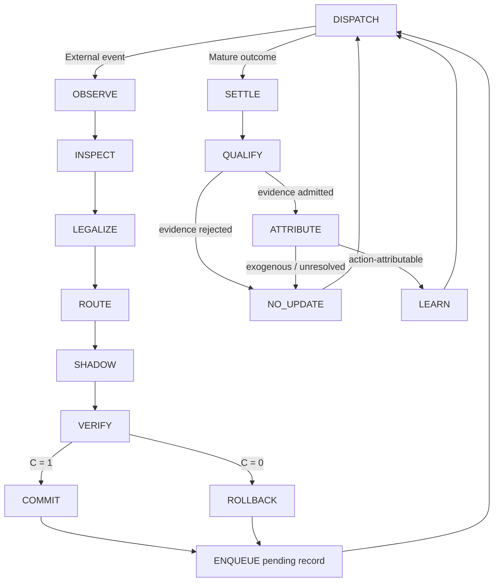

# Counterfactual Memory Debugger：受治理的故障驱动持久状态演化

> **Research Report · Methodology｜组会完整讲述版（约 20 分钟）**  
> 项目：CMD（Counterfactual Memory Debugger）  
> 主题：问题形式化、异步运行时、证据结算、经验路由与能力生命周期  
> 证据口径：本文档描述方法与实现合同，不把开发集结构指标表述为正式效果结论。

---

## 汇报时间安排

| 时间 | 内容 | 希望听众带走的问题 |
|---|---|---|
| 0:00–1:30 | 动机与核心观点 | 为什么长期记忆修复不是普通的单步 prediction？ |
| 1:30–5:00 | 3.1 持久自适应状态 | 系统究竟在“自适应”什么？ |
| 5:00–8:00 | 3.2 异步演化 | 为什么状态提交和学习更新必须解耦？ |
| 8:00–10:30 | 3.3 受治理经验 | 为什么失败、回滚、负奖励都不能直接当监督？ |
| 10:30–12:00 | 3.4 类型化能力 | 一个 repair skill 为什么首先是一份状态转移契约？ |
| 12:00–15:00 | 4.1–4.2 运行时与合法化 | 谁拥有修改持久状态的权限？ |
| 15:00–18:00 | 4.3–4.5 路由、事务与学习 | 失败如何真正改变未来决策？ |
| 18:00–19:15 | 4.6 能力集合更新 | 能力演化和路由适应有什么区别？ |
| 19:15–20:00 | 总结、边界与讨论 | 当前方法证明了什么，还没有证明什么？ |

---

## 0. 开场：从一次性纠偏到持久演化闭环（0:00–1:30）

长期运行的 Agent 会把过去的交互、工具结果和状态更新带到未来。一次错误写入因此不只影响当前答案，还会改变后续交互所依赖的状态。更困难的是，真实运行时通常没有即时 gold answer：一个修复是否正确，可能要等到若干事件之后，才通过复发、冲突消失、下游任务效用或安全信号表现出来。

现有工作已经分别推进了记忆审计、故障归因、局部修复、记忆重写、skill 更新和路由优化，因此本文的出发点不是笼统地宣称“以往方法不会纠错”或“没有记忆演化”。更准确的研究缺口集中在两个相互关联的断点。

### 0.1 断点一：错误纠偏难以沉淀为后期进化资产

许多方法把纠偏过程终止在“定位错误并删除”“得到一次修复后的回答”或“根据当前 reward 更新策略”。这些操作能够解决当前故障，却通常没有同时保存精确前状态、实际执行的动作版本、守卫结果、回滚状态、延迟后果和来源绑定。结果是：系统知道这一次做了什么，却无法证明后来观察到的成败究竟属于哪一次状态转移，也无法判断这条记录是否仍适合更新当前版本的路由器或能力库。

因此，**纠偏结果并不会天然成为进化资产**。只有当它被表示为 decision-bound、version-bound、state-bound 的转移记录，并经过异步结算、证据资格审查和因果归因后，它才能从一次性 operational event 转化为可跨 episode 复用的 adaptive evidence。否则，后期所谓“进化”只能依赖松散日志、自由文本反思或即时奖励，难以重放，也容易把外生失败和被删失结果错误回填给修复动作。

### 0.2 断点二：缺少围绕持久状态的稳定闭环

已有 memory evolution 或 skill evolution 方法表明，记忆组织、策略和技能可以随交互更新；但这不等于已经形成面向持久状态的稳定闭环。一个稳定闭环至少需要回答：谁有权修改 live state；候选修改在哪里隔离执行；验证失败后能否恢复精确前状态；延迟结果如何跨进程保存并最终结算；什么结果可以进入持久证据；哪些证据可以更新未来控制；系统重启或重复投递后是否仍保持幂等与可重放。

如果这些问题没有被分别建模，memory mutation、outcome observation 和 learner update 就会被压缩成一个同步步骤。其直接风险是：未验证修改提前进入持久状态，当前事件用自己的未来信息训练自己，回滚抹除失败经验，或者旧版本动作的后果污染新版本控制状态。本文所说的“稳定闭环”因此不是一般意义上的 feedback loop，而是一个跨调度迭代仍保持**状态一致性、证据可归因性、更新幂等性与治理边界**的 persistent-state loop。

上述判断来自项目已有相关工作比较，重点对照 MemAudit、MemTrace、ReMem、MSCE、ERSkill 与 CoEvo-Mem 的反馈来源、修复动作、状态对象和治理边界；详细证据与原文摘录见 [`survey_res.md`](survey_res.md) 和 [`survey_report.md`](survey_report.md)。这里将其表述为“共同缺少完整交集”，而不是否认任一工作在单个环节上的贡献。

基于这两个断点，本项目研究的核心问题是：

> **在不修改基础模型权重、也不让 gold label 和未来结果泄漏到决策时刻的前提下，如何把一次可观测故障转化为受治理、可回滚、可追责的持久状态转移，使纠偏结果能够沉淀为后期进化资产，并在异步执行中闭合持久状态、证据与控制更新？**

CMD 的回答不是一个单独的修复模型，而是一台 **Governed Repair Harness**。它把“观察故障—选择干预—修改状态—观察后果—更新策略”拆成具有不同权限的阶段。整套方法最关键的三条分离原则是：

1. **候选生成不等于状态准入**：能生成一个修改，不代表允许它进入持久记忆。
2. **结果出现不等于证据准入**：观测到失败或负奖励，不代表它是语义有效的学习样本。
3. **证据准入不等于学习归因**：有效结果可以保留用于审计，但只有能归因到已执行动作的结果才能更新选择器或能力状态。

这三条分离原则构成后续所有状态、队列、守卫和生命周期设计的主线。它们分别回应上述两个断点：`pending → settled → admitted → attributable` 的证据链把一次纠偏变成可复用资产；\(M,E,\Theta,K,Q\) 的持久化分解和受守卫调度则把这些资产接入一个可恢复、可重放的长期闭环。

---

# 3. 问题形式化

## 3.1 持久自适应状态（1:30–5:00）

### 3.1.1 从“记忆”扩展到“持久自适应状态”

持久记忆是 Agent 异构状态中能够超越当前执行 episode 而继续存在的部分。它不同于一次 LLM forward pass 的 hidden computation：一旦修改持久记忆，未来检索、推理和行为所面对的前提也会随之改变。

然而，长生命周期 Agent 积累的不只有显式记忆内容。它还可能积累：哪些 repair action 在什么故障模式下更有效的路由经验、可复用且具有版本的过程化能力，以及从历史状态转移中结算得到的结构化证据。为此，我们把机器迭代 \(n\) 时的持久自适应状态统一写为：

\[
Z_n=(M_n,\Theta_n,K_n,E_n).
\]

其中：

- \(M_n\)：显式持久记忆，即未来任务直接读取或检索的 memory state；
- \(\Theta_n\)：持久路由经验，决定合法动作之间的未来偏好；
- \(K_n\)：具有类型、版本和生命周期的状态转移能力集合；
- \(E_n\)：已经完成结算、通过语义准入的持久证据。

完整运行时还需要容纳瞬时计算和未结算异步结果：

\[
X_n=(H_n,Z_n,Q_n)
    =(H_n,M_n,\Theta_n,K_n,E_n,Q_n).
\]

\(H_n\) 是当前步骤内的瞬时 LLM 与 harness 状态，不要求跨步骤持久；\(Q_n\) 是持久化调度队列，其中存放已经绑定原始决策、但后果尚未完成结算的 transition record。

这里必须强调：

\[
E_i^{pending}\in Q_n \not\Rightarrow E_i^{pending}\in E_n.
\]

进入队列只说明“这次尝试需要在未来被继续观察”，并不说明它已经成为可信经验。与此同时，append-only 事件历史 \(H_{evt}\) 是运行时使用的不可变来源信息。它可以被读取和审计，但它是外生历史，不是通过学习得到的自适应参数。

这个扩展状态模型对应本文的第一个方法判断：**纠偏只有在改变 \(M\) 之外，还留下可结算的 \(Q\)、可准入的 \(E\)，并最终能够更新 \(\Theta\) 或 \(K\) 时，才真正成为后期进化资产。** 只记录“修复后的 memory”会丢失动作与结果之间的证据链；只记录 reward 又无法恢复精确的状态变化。二者都不足以支撑长期进化。

### 3.1.2 三类演化与固定治理

这一状态分解使“自演化”不再是模糊说法。我们区分：

\[
M_n\rightarrow M_{n+1} \qquad \text{持久状态演化},
\]

\[
E_n\rightarrow E_{n+1} \qquad \text{证据演化},
\]

\[
(\Theta_n,K_n)\rightarrow(\Theta_{n+1},K_{n+1})
\qquad \text{自适应控制演化}.
\]

一次普通 memory write 可能只改变 \(M\)，却完全不改变系统以后选择状态转移的方式。只有当较早转移的结算结果成为已经准入且可归因的经验，并进一步改变 \(\Theta\) 或 \(K\) 时，我们才称其为**故障驱动的自适应演化**。

所有变化都发生在固定治理协议 \(G\) 下：

\[
G_n=G_{n+1}=G.
\]

\(G\) 定义调度守卫、合法动作、状态准入、证据准入、学习归因和生命周期权限。本文允许 \(M,\Theta,K,E,Q\) 演化，但不允许系统在线学习或改写 \(G\)。后者属于 meta-governance，需要更高层的安全目标、权限来源和验证协议，因此不在本文研究范围内。

### 3.1.3 状态—权限对照表

| 组件 | 是否持久 | 作用 | 唯一关键权限 |
|---|---:|---|---|
| (H_n) | 否 | 当前 LLM/harness 计算 | runtime control |
| (M_n) | 是 | 决定未来显式记忆状态 | 状态准入 (C_t) |
| \(\Theta_n\) | 是 | 影响未来 action selection | 归因 (A_G) + learner update |
| (K_n) | 是 | 定义可用的 typed transitions | attribution + lifecycle governance |
| (E_n) | 是 | 保存已准入的适应经验 | 证据准入 (Q_G) |
| (Q_n) | 直到结算 | 绑定决策与延迟后果 | `ENQUEUE` / `SETTLE` |
| (H_{evt}) | 是且不可变 | 来源历史与审计基底 | append-only provenance |
| (G) | 固定 | 提供所有状态改变权限 | 本文不学习 |

> **口播提示：** 这一页最重要的是把 (M) 和 \(\Theta) 分开。记住了什么，与以后更偏好哪一种修复，是两个不同问题。

## 3.2 故障驱动的异步演化（5:00–8:00）

### 3.2.1 调度器时钟不等于外部事件时钟

同步的“观察—更新—学习”循环假设结果在动作之后立刻可得，但长期记忆修复通常不满足这一点。令调度器在机器迭代 (n) 选择的项目为：

\[
\delta_n\in\{\operatorname{External}(e_t),\operatorname{Mature}(i,y_i)\}.
\]

外部事件编号 (t) 与调度器时钟 (n) 不同。一次较早尝试 (i) 的后果，可能恰好在两个更晚的外部事件之间成熟。在固定治理 (G) 下，一次宏观调度迭代写为：

\[
X_{n+1}=D_G(X_n,\delta_n;H_{evt}).
\]

例如，下列轨迹完全合法：

\[
X_n\xrightarrow{External(e_t)}X_{n+1}
\xrightarrow{Mature(i,y_i)}X_{n+2}
\xrightarrow{External(e_{t+1})}X_{n+3}.
\]

这意味着在 (e_t) 已处理、(e_{t+1}) 尚未调度时，尝试 (i) 的完成事件就可以改变 (E,\Theta,K)。因此，未来动作所读取的是“当前机器快照中的成熟经验”，而不是按外部事件编号强行同步的经验。

### 3.2.2 外部事件路径与成熟结果路径

当调度项为 (External(e_t)) 时，系统：

1. 从当前观测构造故障特征；
2. 在 (G) 下构造合法动作集合 (A_t)；
3. 选择 (a_t\in A_t)；
4. 在隔离状态执行 (\widetilde M=T_{a_t}(M_n))；
5. 用状态准入谓词 (C_t) 决定 commit 或 rollback；
6. 把尚无最终后果的记录加入 (Q)。

候选状态的生成与持久化是两个独立操作：

\[
M_{n+1}=
\begin{cases}
\widetilde M, & C_t=1,\\
M_n, & C_t=0.
\end{cases}
\]

当调度项为 (Mature(i,y_i)) 时，系统不再修改较早事务的 commit 决定，而是结算记录、判断结果是否构成有效经验、执行因果归因，并在满足权限时更新未来控制状态。

治理不是路由器的同义词。(G) 接收机器状态、调度项目、当前观测和不可变历史，并决定：调度守卫、合法动作集合 (A_t)、状态准入 (C_t)、证据准入 (Q_G)、学习器归因 (A_G) 以及能力生命周期权限。路由器只在已经合法化的集合中排序，它无权因为“置信度高”就创造修改权限。

## 3.3 将转移结果作为受治理经验（8:00–10:30）

### 3.3.1 为什么自由文本错误不能直接训练

一条 error message 或负 reward 无法独立回答四个问题：修改从哪个精确前状态开始；执行的是哪个能力版本；哪些守卫通过或失败；更晚出现的后果是否与这次尝试存在可接受的因果绑定。因此，运行时在前台事务结束时先生成一个 decision-bound pending record：

\[
E_t^{pending}=\bigl(h(M_n),\sigma_t,a_t,v_t,\tau_t^{due},\varnothing,p_t\bigr),
\]

其中 (h(M_n)) 绑定精确前状态，\(\sigma_t\) 是决策时故障特征，(a_t) 标识被选择能力的精确版本，(v_t) 保存即时验证结果，\(\tau_t^{due}\) 是最早结算索引，(p_t) 是来源信息，\(\varnothing\) 明确表示下游后果尚未知。

后果成熟后：

\[
E_t^{pending}\xrightarrow{SETTLE(y_t,\tau_t)}E_t^{raw}.
\]

(E_t^{pending}) 是调度器状态，(E_t^{raw}) 是审计候选；二者都不自动等于自适应经验。

### 3.3.2 三道不可互换的权限

第一道权限是**状态准入**：

\[
Commit_t=C_t.
\]

它只回答候选修改是否进入 (M)。第二道权限是**证据准入**：

\[
Q_G(E_t^{raw})=
\begin{cases}
E_t^{adm}, & \text{来源、绑定、成熟、非删失和 past-only 守卫通过},\\
\varnothing, & \text{否则}.
\end{cases}
\]

第三道权限是**学习器归因**：

\[
A_G(E_t^{adm})\in
\{\text{action-attributable},\text{transition-exogenous},\text{unresolved}\}.
\]

因此可能出现三种容易混淆但语义完全不同的情况：

- rollback 保护了 (M_n)，但该尝试仍可形成有价值的负经验；
- commit 改变了 (M_n)，但其延迟结果可能来源无效、被删失或属于外生扰动，因而不能训练；
- 结果通过 (Q_G) 后进入 (E_n)，但归因为 exogenous 或 unresolved，所以保留审计价值而不改变 \(\Theta_n,K_n\)。

从“后期进化资产”的角度看，一条记录至少要完成四次转换：从一次操作事实变成 decision-bound record，从待处理记录变成 settled outcome，从原始结果变成 admitted evidence，再从可审计证据变成 action-attributable experience。缺少任何一步，系统都不应把它用于未来控制更新。这一要求比保存 failure buffer 更严格，因为 buffer 只回答“过去发生过失败”，而这里还必须回答“失败属于哪个精确版本的哪一次状态转移，以及当前学习器是否仍有权消费它”。

形式上：

\[
Q_G(E_t^{raw})=E_t^{adm}\Rightarrow
E_{n+1}=E_n\cup\{E_t^{adm}\},
\]

而只有

\[
A_G(E_t^{adm})=\text{action-attributable}
\]

时，更新函数 (U) 才能改变 \((\Theta_n,K_n)\)。因此，故障既不是应丢弃的噪声，也不是天然可信的监督；它是一个候选 transition outcome，其状态后果、证据后果和自适应后果分别受治理。

## 3.4 类型化状态转移能力空间（10:30–12:00）

系统选择的基本单元不是自由文本建议，而是一个有类型、有版本的状态转移契约：

\[
k=(P_k,R_k,W_k,T_k,F_k,V_k,B_k).
\]

| 字段 | 含义 | 执行阶段 |
|---|---|---|
| (P_k) | 合法性前置条件 | selection 前 |
| (R_k) | 声明读取集合 | execution 前 |
| (W_k) | 声明写入集合和局部性边界 | execution 前 |
| (T_k) | 候选状态转移 | shadow 阶段 |
| (F_k) | 禁止副作用 | verification 阶段 |
| (V_k) | 持久化验证谓词 | shadow 后、commit 前 |
| (B_k) | 回滚行为 | rejection 时 |

一个 capability proposal 必须经过 schema validation、编译、replay、来源检查、安全约束、held-out shadow validation 和 (G) 定义的生命周期许可，才可能成为未来 (K_n) 中可选择的版本。也就是说：**能力生成不等于能力准入，能力集合可演化也不等于治理协议可演化。**

在项目代码里，这一合同落在 `OperatorSpec`、`SkillRevision`、sealed `RegistrySnapshot` 与 shadow executor 等结构上；稳定服务要求候选版本唯一、处于 stable 状态，并存在于封存 registry 中。

---

# 4. 方法：Governed Repair Harness

## 4.1 受治理的异步运行时（12:00–13:40）

CMD 在 Agent runtime layer 上部署一个持久化调度器，不修改基础模型权重。调度器包含两个逻辑处理器：前台处理器处理新的 external event 并结束即时状态事务；完成处理器在旧 transition 的后果成熟后执行 settlement、qualification、attribution 和 learning。

### 4.1.1 宏观调度与微观控制状态

令 (c_{n,j}) 为调度迭代 (n) 中第 (j) 步的控制状态。控制状态集合为：

```text
DISPATCH, OBSERVE, INSPECT, LEGALIZE, ROUTE,
SHADOW, VERIFY, COMMIT, ROLLBACK, ENQUEUE,
SETTLE, QUALIFY, ATTRIBUTE, LEARN, NO_UPDATE
```

每个内部步骤满足：

\[
(c_{n,j},X_{n,j})\xrightarrow{G}(c_{n,j+1},X_{n,j+1}).
\]

一次宏观 (X_n\rightarrow X_{n+1}) 处理一个调度项目，并最终返回 `DISPATCH`。



运行时强制四个 component-level invariant：

1. `SHADOW` 期间 live (M) 不变；
2. 只有 `COMMIT` 有权改变 live (M)；
3. 只有 `ENQUEUE` 可把 pending record 加入 (Q)，只有 `SETTLE` 可将其移出；
4. 只有 `QUALIFY` 可改变 (E)，只有 `LEARN` 可改变 \(\Theta) 或 (K)。

四条性质共同给出本文所说的**稳定闭环**：前台事务无论 commit 还是 rollback 都有确定终点；未成熟结果不会被误当成经验；已经成熟的记录最终可由持久队列恢复；重复结算不会重复学习；而任何自适应更新都不能反向改写已经发生的状态提交事实。稳定性在这里指运行时语义稳定与证据链稳定，而不是声称系统性能必然单调上升。

结算对 content-bound attempt identifier 幂等，每次尝试最多结算一次。在弱公平假设下，任何已经成熟且仍在队列中的记录最终都会被调度。因此 rollback 终止的是状态修改事务，不是对该 transition 的观察。

## 4.2 可观测故障接口与合法化（13:40–15:00）

检查器先从截至当前时刻的不可变历史、显式记忆和瞬时状态构造 telemetry：

\[
o_t=I(H_{evt,\le t},M_n,H_n),
\qquad
\sigma_t=\phi(o_t).
\]

\(\sigma_t\) 可以包含冲突、缺失或过时引用、来源异常、结构不一致、CAS anomaly、influence anomaly 等决策时可见的 failure surface；不得包含 gold fault label、oracle transition、下游 outcome、评估器专用 safety judgment 或未来证据。

本文不额外优化一个独立的 diagnosis objective。\(\sigma_t\) 是 telemetry 与 transition control 之间唯一的结构化接口。治理据此构造：

\[
A_t=L(\sigma_t,K_n;G).
\]

合法化器检查能力前置条件、来源、权限、隔离状态、声明局部性和版本兼容性，并形成硬边界：

\[
a\notin A_t\Rightarrow P(a_t=a)=0.
\]

这使高路由分数无法绕过权限。在当前实现中，`Contract` 采用 closed schema，并递归拒绝 gold-derived provenance；三类 repairable incident 在决策边界互斥。候选集合还要求 registry 已 sealed、候选 revision 唯一且 stable、base score 完整覆盖候选集合。

## 4.3 经验自适应状态转移选择（15:00–16:40）

在合法动作集合内，Experience-Adaptive Repair Selector 由 `ObservableResidualGHOSTRouter` 实现。其持久路由状态 \(\Theta_n\) 是基础模型外部的 **Routing Residual Memory**。

令 \(m_t=|A_t|\)。将当前合法动作的 backbone 分数、残差修正、探索扰动和最终分数分别写成向量
\(\mathbf b_t,\mathbf r_{n,t},\mathbf z_{n,t},\mathbf q_{n,t}\in\mathbb R^{m_t}\)。再令
\(\boldsymbol\phi_t\in\mathbb R^d\) 表示由 global、pattern 和 local 坐标组成的可观测特征向量，
\(W_{n,A_t}\in\mathbb R^{d\times m_t}\) 表示当前合法动作对应的持久路由参数矩阵。自适应路由写为：

\[
\mathbf q_{n,t}=\mathbf b_t+W_{n,A_t}^{\mathsf T}\boldsymbol\phi_t+\mathbf z_{n,t}.
\]

其中，\(W_{n,A_t}^{\mathsf T}\boldsymbol\phi_t=\mathbf r_{n,t}\)。对单个动作 \(a\in A_t\)，上述向量式的第 \(a\) 个分量为：

\[
q_{n,t}(a)=b_t(a)+\boldsymbol\phi_t^{\mathsf T}W_{n,:,a}+z_{n,t}(a).
\]

因此，\(q_{n,t}(a)\) 是用于比较动作的标量输出，而不是单个可学习参数；可学习部分是按特征和动作展开的矩阵 \(W_n\)。当前实现以稀疏坐标表保存该矩阵，只物化实际出现且达到支持度要求的 global、pattern 和 local 坐标，避免为动态 skill registry 分配大量无观测参数。这里 \(\mathbf z_{n,t}\) 表示探索扰动向量，不要与持久状态 \(Z_n\) 混淆。若 backbone abstain，则 selector 也 abstain；若没有成熟 residual 和成熟 exploration，则严格返回 \(a_t^0\)，而不是重新按 base score 排序。这一 **cold-start identity** 把基础模型能力与持久经验增益分离开来。

### 4.3.1 从粗到细的经验坐标

对动作 (a)，坐标及权重为：

\[
\begin{aligned}
k&=(global,a),                  &w_{t,k}&=1,\\
k&=(pattern,p,a),               &w_{t,k}&=\rho_{t,p},\\
k&=(local,p,j,a),               &w_{t,k}&=\rho_{t,p}\frac{x_{t,j}}{\lVert x_t\rVert_1}.
\end{aligned}
\]

其中 \(\rho_{t,p}\in[0,1]\) 且 \(\sum_p\rho_{t,p}=1\)，表示对 observable pattern revision 的决策时责任权重；(x_t) 是由 \(\sigma_t\) 导出的有序有限特征向量，可包含带符号特征。当 \(\lVert x_t\rVert_1=0\) 时不创建 local coordinate。二者都不含 evaluator-only semantic family id。

每个坐标维护：

\[
\Lambda_{k,0}=1,\qquad \eta_{k,0}=0,
\qquad \mu_{k,n}=\frac{\eta_{k,n}}{\Lambda_{k,n}},
\qquad s_{k,n}=\Lambda_{k,n}-1.
\]

只有支持度越过层级阈值的坐标才激活。注册默认配置为：

```text
global support threshold  = 2
pattern support threshold = 4
local support threshold   = 8
exploration support       = 4
exploration scale γ       = 0.08
```

因此：

\[
R_{n,t}(a)=\sum_{k\in I_t(a)}
\mathbf 1[s_{k,n}\ge \tau_{level(k)}]w_{t,k}\mu_{k,n}.
\]

探索只在至少两个合法动作的 global support 达到 4 时激活。扰动方差随精度增加而减小，其随机地址绑定 `(seed, event_index, coordinate key, router version)`，所以相同机器快照能够确定性 replay。

## 4.4 事务化状态准入（16:40–17:20）

路由选择只是 proposal。执行器在 copy-on-write shadow state 上计算：

\[
\widetilde M=T_{a_t}(M_n),
\]

随后验证 root correction、structural invariant、safety、mutation locality 和 version consistency。全部通过才令 (C_t=1) 并 commit；否则 rollback 到精确 before root。

两条分支都会生成 root-bound repair receipt 并进入 pending queue。因此 (C_t=0) 不代表记录被丢弃：rollback 阻止有风险的候选污染持久记忆，却保留“某能力版本从某前状态出发、在某组守卫下失败”的可审计事实。

当前实现中的 `EccRepairReceipt` 绑定 `syndrome_id`、`selection_id`、`selected_skill_revision_id`、`probe_id`、before/shadow/after root、commit/rollback、invariant、safety、locality 与 recurrence。非 commit receipt 必须证明 `after_root == before_root`；commit receipt 必须证明 `after_root == shadow_root` 且完整通过 ECC acceptance。

## 4.5 异步证据结算与自适应控制更新（17:20–18:00）

当延迟后果成熟时，完成处理器从 (Q) 中原子删除 pending record，生成 (E_i^{raw})，并拒绝重复 settlement。原始结果通过来源、决策绑定、成熟性、非删失和 past-only 守卫后才进入 (E)。随后归因器利用类型化执行路径判断 `action-attributable`、`transition-exogenous` 或 `unresolved`，而不是让自由文本模型猜测因果关系。

路由学习器遵守 **selected-only** 约束：只有真正在线执行、证据已准入、结果又可归因的 selected action 可以更新。评估器事后得到的 counterfactual shadow outcome 不能冒充未执行动作的在线反馈。

令 (u_i^{pre}) 是绑定原始决策的冻结动作前效用预测，(u_i^{delay}) 是成熟后的可归因效用。对语义无效结果、可归因 rollback 或 delayed regression，令 (u_i^{effective}=-1)；否则取成熟效用。学习目标为：

\[
r_i=\operatorname{clip}(u_i^{effective}-u_i^{pre},-1,1).
\]

更新前先读取所有 parent mean：

\[
y_{global}=r_i,
\]

\[
y_{pattern(p)}=r_i-\mu_{global,a}^{pre},
\]

\[
y_{local(p,j)}=r_i-\mu_{global,a}^{pre}-\mu_{pattern,p,a}^{pre}.
\]

对 selected action 的坐标：

\[
\Lambda_{k,n+1}=\Lambda_{k,n}+w_{i,k}^2,
\qquad
\eta_{k,n+1}=\eta_{k,n}+w_{i,k}y_{i,k}.
\]

所有未选动作坐标不变。local target 减去的是其具体 parent pattern coordinate 的更新前均值，而不是所有 active pattern 的 responsibility-weighted aggregate，因此它是一条逐坐标层级 residual rule，不应被表述为严格的可加概率分解。

至此闭环成立：

```text
pending record
  → raw settled record
  → evidence qualification
  → admitted evidence
  → learner attribution
  → residual-state update
  → future selection policy
```

## 4.6 受治理的能力集合更新（18:00–19:15）

第二个控制组件是能力集合 (K_n)。能力版本是 immutable typed transition contract；revision 产生新版本，不能原地覆盖父版本。论文层面的生命周期为：

```text
PROPOSED → COMPILED → VALIDATED → PROBATION → ACTIVE
ACTIVE   → REVISED | QUARANTINED
QUARANTINED → RETIRED
```

当前仓库中的主 ecology 实现使用下面的工程命名：

| 论文语义 | 当前实现状态 | 含义 |
|---|---|---|
| `PROPOSED` | `proposed` | 只有 proposal，无服务资格 |
| `COMPILED` | `sandboxed` | 已可在隔离环境执行 |
| `VALIDATED` | `shadow_validated` | 已通过 shadow/replay 验证 |
| `PROBATION` | `calibrated` | 仍需证据校准，不直接等同正式激活 |
| `ACTIVE` | `stable` | 可进入 sealed registry 并参与服务 |
| `REVISED` | `revised` | 创建新 immutable revision |
| `QUARANTINED/RETIRED` | 当前主状态机以 `retired` 表示不可服务终态；quarantine 由 registry/治理路径执行 | 不再作为合法候选 |

另一个 operator-library 实验模块采用 `candidate → provisional_active → stable → retired`。这不是方法冲突，而是不同实验层的状态名尚未统一；组会中应按“proposal、隔离验证、试用、稳定服务、修订/退出”的语义解释，并把具体代码状态视为实现映射。

能力 niche 只能由 decision-time observable information 构造，例如 failure surface、structural pattern、permission regime、locality regime 和预测的 transition context。它不能包含 incident gold label、oracle action、transition 后结果或 gold answer。

本文评估生命周期执行与状态转移覆盖，但不声称已经验证了通用 capability-proposal learning algorithm。主要得到实验支持的自适应机制是 Routing Residual Memory；能力 proposal 可以来自外部或程序化生成，而 (G) 负责其准入、版本化、隔离和退役。

---

## 5. 算法汇总：一次完整调度如何运行

```text
Input:
  current machine X_n = (H_n, M_n, Θ_n, K_n, E_n, Q_n)
  immutable history H_evt
  fixed governance G
  scheduled item δ_n

if δ_n = External(e_t):
  o_t ← inspect(H_evt≤t, M_n, H_n)
  σ_t ← observable_failure_features(o_t)
  A_t ← legalize(σ_t, K_n; G)
  a_t ← route_with_backbone_and_residual(A_t, Θ_n)
  M̃  ← shadow_execute(T_a_t, M_n)
  C_t ← verify_root_invariant_safety_locality_version(M_n, M̃; G)
  if C_t: commit M̃
  else:   rollback to M_n
  persist decision-bound E_t_pending into Q_n

if δ_n = Mature(i, y_i):
  E_i_raw ← idempotent_settle(Q_n[i], y_i)
  E_i_adm ← qualify(E_i_raw; G)
  if rejected: audit and NO_UPDATE
  else:
    append E_i_adm to E_n
    attribution ← attribute(E_i_adm; G)
    if attribution = action-attributable and selected-only:
      update Θ_n and, when separately authorized, K_n
    else:
      NO_UPDATE

return X_n+1
```

算法的安全性不依赖“选择器永远选对”，而依赖权限分层：选择器可以犯错，但非法动作在 `LEGALIZE` 前被屏蔽，危险候选在 `VERIFY` 后被 rollback，无效反馈在 `QUALIFY` 被过滤，外生结果在 `ATTRIBUTE` 后不能污染 learner。

---

## 6. 方法性质、实现锚点与可验证主张

### 6.1 关键方法性质

| 性质 | 可检验表述 |
|---|---|
| 隔离性 | shadow execution 不改变 live memory root |
| 显式准入 | live (M) 只能在 commit path 改变 |
| 决策绑定 | receipt 必须绑定原始 syndrome、selection、skill revision 和 before root |
| 回滚可证 | rollback 后 `after_root == before_root` |
| 冷启动恒等 | 无成熟 residual/exploration 时严格返回 backbone action |
| 支持度门控 | global/pattern/local residual 只在各自阈值后激活 |
| selected-only | 未在线执行的动作不得通过 shadow outcome 更新 router |
| past-only | 当前决策不得读取未来或 evaluator-only evidence |
| 幂等结算 | 每个 attempt 最多触发一次 adaptive update |
| 可重放 | snapshot、seed、event index、key 和版本相同时决策可复现 |

### 6.2 仓库实现锚点

- [`cmd_audit/repair/ecc.py`](cmd_audit/repair/ecc.py)：closed `Contract`、root-bound `EccRepairReceipt`、shadow commit/rollback 与 settlement binding。
- [`cmd_audit/repair/ghost_ecology.py`](cmd_audit/repair/ghost_ecology.py)：`ObservableResidualGHOSTRouter`、global/pattern/local residual、support gate、deterministic exploration、selected-only update、registry 与 skill lifecycle。
- [`cmd_audit/repair/operator_library.py`](cmd_audit/repair/operator_library.py)：不可变 operator/skill revision、evidence、library version 与 lifecycle event。
- [`docs/RUNTIME_EVIDENCE_BOUNDARY_CONTRACT.md`](docs/RUNTIME_EVIDENCE_BOUNDARY_CONTRACT.md)：运行时证据防火墙、禁止 same-trace answer replay、封存后评估边界。
- [`docs/MIX_GHOST_ECOLOGY_REPAIR_EXPERIMENT_SPEC.md`](docs/MIX_GHOST_ECOLOGY_REPAIR_EXPERIMENT_SPEC.md)：方法合同、默认阈值、更新公式、生态与实验协议。
- [`tests/repair/test_ecc_runtime.py`](tests/repair/test_ecc_runtime.py)：commit、rollback、root binding 与 gold-free runtime 行为测试。
- [`tests/repair/test_ghost_ecology.py`](tests/repair/test_ghost_ecology.py)：cold-start identity、support gate、mature exploration、snapshot replay 和 selected-only 约束测试。

---

## 7. 结论与研究边界（19:15–20:00）

本方法把长期记忆 Agent 的“自演化”重新表述为一个受治理的异步状态机问题。系统不是看到失败就直接学习，而是先把故障绑定到精确的前状态、能力版本与验证轨迹；状态修改通过事务化准入，延迟结果通过独立证据准入，合格证据再通过因果归因，最后才能改变未来路由或能力集合。

围绕本文提出的两个研究断点，方法回应可以归纳如下：

| 研究断点 | 传统短链路的终点 | CMD 增加的关键结构 | 形成的能力 |
|---|---|---|---|
| 错误纠偏不能成为后期进化资产 | 删除、改写、一次性回答恢复或即时 reward | 状态/决策/版本绑定的 pending record，异步 settlement，\(Q_G\) 资格审查，\(A_G\) 因果归因 | 失败与成功转移均可在满足权限后沉淀为可复用经验 |
| 难以形成持久状态稳定闭环 | mutation、evaluation、update 被压缩为同步步骤 | \(M,\Theta,K,E,Q\) 分层持久化，shadow/commit/rollback，幂等 settlement，固定治理 \(G\) | 跨 episode、跨进程和跨延迟结果维持一致、可恢复、可重放的状态机 |

这两项并不是彼此独立的附加功能。没有稳定持久闭环，纠偏记录无法可靠完成后续结算；没有可准入、可归因的进化资产，闭环又只能重复修复，而不能改变未来行为。CMD 的方法贡献正是在固定治理下把二者接成同一条受约束的因果链。

一句话概括整套方法：

> **我们把一次错误纠偏变成可以在未来被安全消费的进化资产，同时让这种消费始终受持久状态边界、证据边界和因果边界约束。**

当前可以主张的是：项目已经实现并测试了 typed shadow repair、commit/rollback、root-bound receipt、cold-start identity、support-gated residual routing、deterministic replay 和 selected-only update 等关键机制。这些结果支持“闭环结构已经可执行”，但还不等于证明长期运行性能稳定、收益单调或跨域泛化成立。当前也不应主张治理协议 \(G\) 已能自我学习、自由生成的 capability proposal 已被证明具有普适有效性，或开发环境中的结构效用已经等同于 sealed benchmark answer quality。

建议组会讨论聚焦三个问题：

1. (Q_G) 与 (A_G) 的规则应如何在不同部署域中校准，才能兼顾证据利用率与污染风险？
2. 弱公平与非删失假设在真实异步系统中不成立时，如何处理长期不成熟或选择性缺失的 outcome？
3. 当未来研究 meta-governance 时，什么更高层不变量能够约束 (G\rightarrow G')，避免治理更新自行扩大权限？

---

## 附录 A：组会口播收束句

“现有系统可以完成一次纠偏，也可以更新记忆或技能，但一次修复结果并不会自动成为未来进化可以安全使用的资产。CMD 的关键贡献，是把一个可能犯错的 repair selector 放进可治理的持久状态机：候选动作先合法化，修改只在 shadow 中发生，commit 与证据资格彼此独立，真正学习还需要 selected-only 因果归因。这样，rollback 的失败仍可在未来成熟为负经验，commit 的修改如果证据不合格也不会污染路由器。我们得到的不是一个简单 feedback loop，而是一条从持久前状态、受治理转移、延迟结果到未来策略的可恢复、可重放闭环。”

## 附录 B：术语速查

| 术语 | 本文含义 |
|---|---|
| persistent adaptive state | 跨 episode 持久的 (M,\Theta,K,E) 联合状态 |
| governance (G) | 固定的权限、准入、归因与生命周期协议 |
| pending record | 已绑定决策但尚无成熟后果的队列记录 |
| admitted evidence | 已结算并通过语义资格审查的结果 |
| action-attributable | 可用于更新已执行动作相关控制状态的归因结果 |
| shadow execution | 在不改变 live root 的隔离候选状态上执行 transition |
| Routing Residual Memory | 位于基础模型外、按动作条件化的持久经验坐标 |
| cold-start identity | 无成熟自适应信号时与 frozen backbone 严格一致 |
| selected-only | 在线 learner 只使用真实执行动作的后果 |
| meta-governance | 学习或修改治理协议 (G) 本身；本文不研究 |
