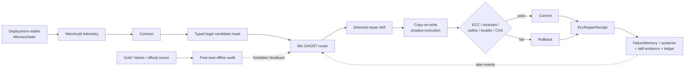

# Counterfactual Memory Debugger：面向智能体长期记忆的无 Gold 修复、治理与生态路由

> **组会 Research Report｜建议汇报时长：20 分钟**  
> 项目：CMD（Counterfactual Memory Debugger）  
> 报告日期：2026-09-02  
> 证据口径：代码与协议已实现；当前量化结果主要是 **development structural evaluation**，不是 sealed confirmatory answer-quality 结论。

---

## 0. 一页结论（0:00–1:00）

本项目研究的问题是：**当长期运行的 LLM Agent 因记忆错误而失败时，系统能否在不读取数据集 gold answer、故障标签或同轨迹 answer replay 的条件下，定位记忆状态问题，执行可回滚修复，并从修复回执中持续学习？**

CMD 将这个问题建模为一个受治理约束的在线记忆状态校正过程：系统先从部署可见信号形成互斥的 ECC syndrome，再由 GHOST/Mix GHOST 路由器选择类型化修复策略；候选修复在 copy-on-write shadow state 中执行，通过结构、安全、局部性与 CAS 检查后才提交，并把结果写成 provenance-bound `EccRepairReceipt`。路由器只从成熟回执学习，不读取 benchmark 答案质量。

当前开发实验给出三个主要观察：

1. 在 2 个 backbone、12 条 stream、每个模型 301 个 repair receipt 的七臂比较中，`mix_ghost` 的 stream-macro utility 均约为 **0.722**，高于所有已测路由臂；相对 `best_global` 的 family-blocked mean delta 分别为 **0.0584** 和 **0.0610**，95% bootstrap CI 均不跨 0。
2. 路由消融显示，global residual、local residual 和 support gate 都能贡献效用；不同 backbone 的增益结构不同，说明不能把某一层路由机制泛化为恒定主因。
3. A–B–A recurrence 中 Mix GHOST 的 return-phase 描述性优势较小，family-blocked CI 跨 0；而且 development source 与 target case 完全重叠。因此，**已建立的是机制可运行性与开发集上的条件化优势，不是 held-out 泛化或正式安全性结论。**

> **口播重点：** 今天最重要的不是“我们又做了一个 memory benchmark”，而是把记忆修复拆成了可审计的运行时闭环，并严格区分“系统用来做决策的证据”和“实验结束后用来评分的答案”。

---

## 1. 研究背景与问题定义（1:00–3:00）

### 1.1 为什么长期记忆会成为 Agent 的新故障面

长期记忆系统不只会“忘记”，还可能把错误状态持续带入未来任务：检索链路可能漏掉关键证据，旧状态可能覆盖新状态，冲突记忆可能同时进入上下文，低可信内容可能被当作权威事实，压缩或注入过程还可能破坏原始语义。和单轮 hallucination 不同，这类错误具有三个特点：

- **持续性**：一次错误写入或错误更新会污染后续多个请求；
- **状态性**：修复对象不是一句回答，而是检索、索引、谱系、隔离区等共同组成的 memory state；
- **反馈稀缺**：真实部署通常没有逐请求 gold answer，也不能在运行时依赖 benchmark label。

因此，单纯提高检索分数或增加一次 LLM judge，并不能回答“哪一部分状态应该被如何修改、修改是否安全、修改结果如何进入后续学习”这三个问题。

### 1.2 核心研究问题

本项目围绕四个研究问题展开：

- **RQ1：运行时证据边界。** 在完全隔离 gold、label、reference answer 和 same-trace replay 的条件下，能否形成可执行的故障 syndrome？
- **RQ2：修复可执行性。** 能否把抽象诊断转换为类型化、局部、可回滚的 memory-state transition？
- **RQ3：在线选择与演化。** 能否仅依赖 repair receipt，让路由器在不同 fault family、局部模式和生态位上改善策略选择？
- **RQ4：因果评估与治理。** 能否证明评分只发生在修复与预测封存之后，并把 before/after 差异限制为预注册修复操作？

### 1.3 研究边界

CMD 不把内部故障类型当作需要追求 macro-F1 的分类任务；它们是 repair search 的 action space。项目也不声称发明新的基础模型、新数据集或通用演化算法。当前承重贡献是：

1. gold-free、receipt-driven 的 ECC memory correction loop；
2. copy-on-write、rollback、CAS、hash-chain ledger 组成的可审计修复治理；
3. global / pattern / local / niche posterior 融合的 Mix GHOST 参数化路由；
4. 将开发性结构证据与 sealed answer-quality 证据严格分层的评估协议。

---

## 2. 相关工作与研究空位（3:00–5:00）

项目调研覆盖 MemAudit、Double Ratchet、MSCE、ERSkill 和 CoEvo-Mem 等直接相关工作。它们分别覆盖了记忆反事实归因、metric/skill 共进化、training-free memory–skill evolution、skill router 和 memory graph/router co-evolution，但没有同时覆盖以下四个维度：

| 维度 | 现有路线的典型能力 | CMD 的关注点 |
|---|---|---|
| 反馈 | harmful event、golden dev、终局 reward、LLM-as-a-Judge | 运行时只读部署可见 telemetry 与 repair receipt |
| 归因/修复 | leave-one-out 删除、skill 增删、策略更新 | 对 memory state 执行 typed shadow transition |
| 故障范围 | 投毒或任务失败为主 | process fault、state drift、adversarial poison 的互斥治理 |
| 审计 | 多数工作没有 append-only repair ledger | root binding、hash chain、seal、rollback 与 provenance |

CMD 与 MemAudit 的关系最紧密：MemAudit 提供记忆审计/归因思想，而 CMD 将其推进为**运行时状态修复和持续路由学习**。区别在于，CMD 当前协议不允许把外部 harmful-event scorer、gold answer 或 same-trace answer replay 作为路由反馈。

> **本项目的研究空位：** 不是单独提出一个更强 scorer，而是研究“gold-free detection × typed repair × receipt-only evolution × auditable governance”是否能够组成闭环。

相关调研证据见 [`survey_res.md`](survey_res.md)。

---

## 3. 方法：从 syndrome 到可审计修复回执（5:00–10:00）

### 3.1 总体架构



运行时 ABI 是：

```text
Contract
  -> shadow transition
  -> EccRepairReceipt
  -> delayed settlement
  -> router / failure-memory / skill-evidence update
```

系统的关键设计不是“先预测一个 label，再按表修复”，而是：

1. 根据 state 与 telemetry 生成 syndrome；
2. syndrome 限制 legal operator set；
3. 路由器只在合法集合中选择已冻结或受治理的新策略；
4. 修复先作用于 shadow state；
5. 只有通过全部 gate 才能改变 live state；
6. 结果被编码为可验证回执，在后续事件到来前结算。

### 3.2 三类互斥 incident 与修复语义

| Incident | 核心问题 | 主要状态操作 | 治理落点 |
|---|---|---|---|
| `process_fault` | 检索、注入、粒度或安全处理流程错误 | targeted repair / rebuild / pipeline patch | `FailureMemory` 与流程修复证据 |
| `state_drift` | 新事实应 supersede 旧状态 | supersede / cascade，并保持 lineage | supersession graph 与状态谱系 |
| `adversarial_poison` | 不可信事件试图取得错误权威 | quarantine / quarantine-and-rebuild | quarantine + audit ledger |

三者不能跨型 fallback；不确定时应 abstain，而不是把不确定 incident 强行写入错误的长期记忆库。

### 3.3 ECC 治理：为什么修复不能直接写 live state

CMD 把一次修复视为受约束的状态迁移，而不是字符串替换。对于 pre-state \(S_t\)、修复操作 \(a_t\) 和 shadow executor \(T\)：

\[
\tilde{S}_{t+1}=T(S_t,a_t)
\]

只有当根绑定、结构不变量、安全检查、局部性预算和 compare-and-swap 条件同时通过时，才提交：

\[
S_{t+1}=\begin{cases}
\tilde{S}_{t+1}, & \text{if } G_{root}\land G_{inv}\land G_{safe}\land G_{local}\land G_{CAS}\\
S_t, & \text{otherwise (rollback)}
\end{cases}
\]

`EccRepairReceipt` 至少需要绑定 before/after root、执行策略、变更范围、gate 结果、commit/rollback 状态和 provenance。append-only、hash-chained ledger 使事件顺序与篡改可审计。

### 3.4 Mix GHOST：多层后验的参数化路由

Mix GHOST 不修改基础模型，而是在 frozen backbone policy 上叠加多个受支持度约束的 posterior/residual：

\[
s(a\mid x)=s_{backbone}(a\mid x)
+r_{global}(a)
+r_{pattern}(a\mid p_x)
+r_{local}(a\mid \ell_x)
+r_{niche}(a\mid n_x)
\]

其中 \(p_x\)、\(\ell_x\)、\(n_x\) 分别表示 pattern、local context 与行为生态位。support gate 在证据不足时压制高方差 override，避免少量回执把路由器推向激进策略。实现上只允许 receipt settlement 更新 posterior，当前事件不能用自己尚未成熟的结果训练自己的选择。

### 3.5 证据防火墙

项目的权威协议规定：dataset labels、gold/reference answers、split identifiers、post-outcome annotations 只能进入封存后的 evaluator。它们不能进入 retrieval、mutation、selection、context construction、receipt creation 或 online router update。即使这些字段被嵌套在通用 metadata 中，也仍然属于泄漏。

详细合同见 [`docs/RUNTIME_EVIDENCE_BOUNDARY_CONTRACT.md`](docs/RUNTIME_EVIDENCE_BOUNDARY_CONTRACT.md)。

---

## 4. 数据、实验协议与评价指标（10:00–13:00）

### 4.1 数据基底

当前开发数据编译器使用公开语义基底，并把合成限定在可追踪的 intervention layer：

| 数据源 | 已验证规模/状态 | 在 CMD 中的作用 |
|---|---|---|
| MemTraceBench | 103 个 JSON graph | process-fault 与执行图 provenance |
| MemFail | 5 个 CSV，492 个物理行 | facts、conditions、persona 与 multi-hop 基底 |
| HaluMem | 40 episodes、3,804 sessions、6,934 questions | 长事件流、更新传播与 delayed effect |
| LoCoMo | 10 个多会话对话 | conversation-grounded state evolution；正式协议含 1,986 QA |
| LongMemEval | 正式协议为 500 questions | state-drift 与长期更新/abstention 评估 |
| Evo-Bench | 160 validation + 448 disjoint evaluation tasks | 正式 agent evolution protocol；本地仅作 smoke/governance |

编译器保留公开 episode 的语义，synthetic intervention 只负责构造 process/state/poison/clean 状态变化。runtime bundle 与 evaluator lockbox 物理分离，public answer、evidence ID、intervention template、expected effect 和 operator oracle 不进入 runtime view。

### 4.2 开发实验矩阵

当前汇总包含：

- 7 个路由臂：`mix_ghost`、`best_global`、`ghost_hierarchy`、`global_thompson`、`contextual_bandit`、`niche_thompson`、`random_legal`；
- 2 个 backbone：Meta-Llama-3.1-8B-Instruct 与 Qwen3-14B；
- 每个 backbone 12 条 matched stream、301 个 receipt；
- stationary / abrupt process-state-poison / A–B–A recurrence；
- family-blocked paired bootstrap 与 routing mechanism ablation。

### 4.3 指标

- **utility**：开发环境中的结构化 repair utility；不能等同于真实 answer quality；
- **pseudo-regret**：相对同一 paired event 上已实现最佳臂的经验差距；
- **locality cost**：修复触达状态的局部代价；
- **collateral cost**：对无关状态造成的结构性影响；
- **family-blocked delta / CI**：先按 family 聚合，再 bootstrap，避免把同 family 事件误当独立样本；
- **official answer metrics**：只在 prediction seal 完成后由 benchmark-author scorer 计算。

### 4.4 正式 confirmatory 设计

正式实验被拆成三个互不汇总的机制轨道：

| Track | Dataset | Primary metric | 最小 gate |
|---|---|---|---|
| process fault | LoCoMo | 按四类 fault subtype 的 paired official F1 delta | 每类至少 25 cases |
| state drift | LongMemEval update cases | new-value adoption 与 old-value suppression | 至少 25 target cases |
| adversarial poison | LoCoMo | ASR 与 attack-success-conditional paired F1 | 至少 25 poison cases |

每条分析使用 10,000 次 paired bootstrap；三条机制禁止 pooled overall score。正式流程为 `build → predict → score → analyze`，scorer 只读取已封存 prediction 与 evaluator sidecar。

协议详情见 [`docs/OFFICIAL_BENCHMARK_PROTOCOLS.md`](docs/OFFICIAL_BENCHMARK_PROTOCOLS.md) 与 [`docs/ECC_CONFIRMATORY_EXPERIMENT.md`](docs/ECC_CONFIRMATORY_EXPERIMENT.md)。

---

## 5. 当前实验结果（13:00–17:00）

### 5.1 七臂总体结果

| Backbone | 最优臂 | Stream-macro utility | Event-weighted utility | Mean pseudo-regret | 相对 best_global 的 family delta（95% CI） |
|---|---:|---:|---:|---:|---:|
| Meta-Llama-3.1-8B-Instruct | mix_ghost | **0.7222** | **0.7141** | **0.0363** | **+0.0584** [0.0437, 0.0733] |
| Qwen3-14B | mix_ghost | **0.7220** | **0.7185** | **0.0315** | **+0.0610** [0.0437, 0.0785] |

在所有预注册 pairwise comparison 中，Mix GHOST 相对其余六臂的 family-blocked 95% CI 都高于 0。相对 `random_legal` 的 mean delta 最大：Llama 为 **+0.1729**，Qwen 为 **+0.1754**。这说明多层 posterior 的组合不是简单随机选择带来的表面收益。

但需要强调两点：第一，这些 safety 值是 structural proxy，不能写成“安全修复率 100%”；第二，结论是“在当前开发矩阵中最强”，不是“在每条 stream 上都获胜”。Llama 下 Mix GHOST 相对 ghost hierarchy 为 8 胜、2 负、2 平；Qwen 下为 11 胜、0 负、1 平。

### 5.2 路由消融

| Backbone | Frozen backbone | +Global | +Pattern | +Local | Full Mix GHOST | Full-router delta |
|---|---:|---:|---:|---:|---:|---:|
| Llama-3.1-8B | 0.6511 | 0.6891 | 0.6926 | 0.7033 | **0.7141** | **+0.0630** |
| Qwen3-14B | 0.6396 | 0.7166 | 0.7167 | 0.7210 | **0.7208** | **+0.0812** |

Llama 上 global residual、local residual 和 support gate 都有可见贡献；Qwen 上主要增益来自 global residual，pattern/local 的边际增益较小。这里呈现的是一个重要的负面边界：**不能声称 local 或 niche 层在所有模型上都是主要贡献源。** 模型与数据流改变时，posterior 层的有效性可能重新分配。

### 5.3 A–B–A recurrence

在 A 环境返回阶段，Mix GHOST 相对 ghost hierarchy 的 family-macro delta 为 **+0.0093**，但 95% CI 为 **[-0.0019, 0.0225]**，跨越 0。描述性上，Mix GHOST 的 return utility 为 0.7578，高于 ghost hierarchy 的 0.7493；统计上尚不能支持“稳定保留生态记忆”的强结论。

### 5.4 结果应该怎样解释

当前证据支持：

- Mix GHOST 在当前 matched development streams 上具有稳定的平均优势；
- 多层路由和 support gate 确实参与了效用改善；
- 运行时 gold-free、receipt-only、COW/rollback/ledger 闭环已具备可执行实现；
- 数据编译、运行时 bundle、evaluator lockbox 和机制隔离协议已经成形。

当前证据不支持：

- 对未见 family 的泛化：source–target overlap audit 显示当前 development run 的 target overlap rate 为 **1.0**；
- confirmatory safe repair：结构 gate 全通过不等于真实 false-commit rate 已被验证；
- answer-quality 提升：还缺 receipt-bound before/after 的正式模型预测和官方评分；
- 超越 Mem0、MemSkill、ERSkill 等 memory baselines：controlled result table 仍为空；
- 跨机制总分：process fault、state drift、poison 必须分别报告。

完整开发结果见 [`未命名/analysis/paper-analysis.md`](未命名/analysis/paper-analysis.md) 与 [`未命名/analysis/derived/routing-ablation.md`](未命名/analysis/derived/routing-ablation.md)。

---

## 6. 局限、风险与下一步（17:00–19:00）

### 6.1 当前局限

1. **数据尚未 F-DATA freeze。** 数据已可用于 development pilot，但 benchmark-scale distribution target、人工抽检和 confirmatory family holdout 仍需完成。
2. **开发实验存在 source–target overlap。** family-blocked bootstrap 能处理 family 内相关性，但不能修复训练/迁移 case 重叠。
3. **utility 仍是结构代理。** 它验证路由与治理机制是否按设计运行，不直接证明答案更正确或用户风险更低。
4. **正式系统对比缺失。** upstream checkout、模型/API 和 controlled/native adapter 结果尚未配置齐全。
5. **A–B–A 证据偏弱。** return-phase 优势没有排除 0，生态记忆只能作为描述性结果。
6. **复杂度成本需要单独报告。** 多层路由、账本、shadow execution 与 benchmark scorer 会增加状态、存储和实验工程成本。

### 6.2 推荐执行顺序

```text
F-DATA scale + human audit + family/constructor holdout
  -> freeze model snapshots / baseline commits / seeds / checksums
  -> process-fault confirmatory track
  -> state-drift confirmatory track
  -> poison calibration then held-out confirmatory track
  -> official scoring + paired bootstrap
  -> controlled and native industry baselines
  -> paper claim ledger freeze
```

优先级上，应先完成可直接绑定 repair efficacy 的三条 ECC confirmatory track，而不是继续扩张机制。任何新结果都必须先回答：runtime 是否完全看不到 evaluator 字段、before/after 是否只差预注册操作、prediction 是否先 seal、scorer 是否无法回写 router。

---

## 7. 总结（19:00–20:00）

CMD 的核心观点是：**Agent memory failure 不应只被看成一次检索错误或一次回答错误，而应被看成一个需要诊断、受约束修复、验证、回滚、记账和持续学习的状态系统问题。**

项目已经完成了从 `Contract` 到 `EccRepairReceipt` 的 gold-free runtime loop，并在开发实验中观察到 Mix GHOST 相对多种路由基线的稳定平均优势。与此同时，项目主动保留了关键负结果：A–B–A 生态记忆证据尚不显著、development transfer 存在完全 case overlap、结构安全代理不能替代正式 answer-quality 与 false-commit 评估。

因此，当前最准确的项目定位是：

> **一个已经完成机制闭环与开发性验证、正在进入 sealed confirmatory evaluation 的可审计长期记忆修复系统。**

下一阶段的成功标准不是增加更多模块，而是让三条机制隔离的正式实验给出可复核的 before/after answer-quality、攻击成功率、状态更新正确性和置信区间，并把 claim ledger 冻结到这些证据能够支持的范围内。

---

## 8. 组会可能问答

### Q1：既然不看 gold，系统怎么知道修复是对的？

运行时不判断“最终答案是否和 gold 一样”，而是检查修复后的 memory state 是否满足 root、结构不变量、安全、局部性和 CAS 条件，并从延迟成熟的 deployment-visible receipt 学习。gold/reference answer 只在预测封存后评估系统效果，两者职责分离。

### Q2：这还是反事实方法吗？

是，但项目将反事实严格定义为同一 frozen pre-state 上的 ECC shadow transition，而不是删除一条记忆后重跑同一问题并用 gold 打分。前者能进入真实运行时治理，后者只适合作为离线分析。

### Q3：Mix GHOST 的优势会不会来自更多参数或更多预算？

当前 matched experiment 对 case order、候选集合和 receipt 流做了对齐，并包含 `best_global`、global/niche Thompson、contextual bandit、ghost hierarchy 与 random legal 等对照。消融显示 full router 有增益，但正式论文仍需报告每层状态量、更新预算和推理开销。

### Q4：为什么不能把三个 incident 合成一个总分？

因为 process fault、state drift 和 poison 的干预语义、正确修复、风险与指标不同。合并会用大量容易样本掩盖某一类严重失败，也会破坏因果解释，所以协议明确禁止 pooled cross-mechanism score。

### Q5：当前最致命的实验缺口是什么？

是 held-out、receipt-bound、officially scored 的 confirmatory evidence。现有开发实验可以支持机制选择和工程决策，但 source–target overlap 为 1.0，不能用来声称跨 family 泛化。

### Q6：与 MemAudit 的本质差异是什么？

MemAudit 更接近 post-hoc harmful-memory attribution/removal；CMD 的重点是在线 memory-state correction：typed syndrome、受治理 operator、shadow execution、commit/rollback、receipt settlement 和持续路由学习。CMD 也把 gold/replay 与 runtime 决策完全隔开。

### Q7：为什么需要 ledger？

因为长期记忆修复会改变后续所有请求的状态。没有 append-only root-bound 记录，就难以回答“何时因何证据修改了哪部分状态、谁批准提交、能否验证未被篡改、失败后是否真正回滚”。ledger 是修复系统可追责性的基础，不只是日志美化。

---

## 9. 汇报时间控制表

| 时间 | 内容 | 必讲信息 |
|---|---|---|
| 0–1 min | 一页结论 | gold-free runtime loop；当前证据边界 |
| 1–3 min | 背景与 RQ | 记忆故障是状态问题，不只是回答问题 |
| 3–5 min | 相关工作 | 四维交集空位；与 MemAudit 的区别 |
| 5–10 min | 方法 | syndrome、Mix GHOST、COW/ECC、receipt、firewall |
| 10–13 min | 数据与协议 | public substrate、三条 confirmatory track、禁止 pooled score |
| 13–17 min | 结果 | 七臂表、路由消融、A–B–A 负边界 |
| 17–19 min | 局限与下一步 | overlap、structural proxy、official score 缺口 |
| 19–20 min | 总结 | 已完成机制闭环，下一步是 sealed confirmation |

---

## 10. 证据索引

- 项目运行时总览：[`CLAUDE.md`](CLAUDE.md)
- 运行时证据边界：[`docs/RUNTIME_EVIDENCE_BOUNDARY_CONTRACT.md`](docs/RUNTIME_EVIDENCE_BOUNDARY_CONTRACT.md)
- 正式 benchmark 协议：[`docs/OFFICIAL_BENCHMARK_PROTOCOLS.md`](docs/OFFICIAL_BENCHMARK_PROTOCOLS.md)
- ECC confirmatory 方案：[`docs/ECC_CONFIRMATORY_EXPERIMENT.md`](docs/ECC_CONFIRMATORY_EXPERIMENT.md)
- 数据验证：[`data_validation.md`](data_validation.md)
- 相关工作调研：[`survey_res.md`](survey_res.md)
- 开发实验总表：[`未命名/analysis/paper-analysis.md`](未命名/analysis/paper-analysis.md)
- 路由消融：[`未命名/analysis/derived/routing-ablation.md`](未命名/analysis/derived/routing-ablation.md)
- 当前机器可读汇总：[`未命名/analysis/current-summary.json`](未命名/analysis/current-summary.json)

> **使用提醒：** 如果正式实验在组会前完成，应优先替换 §5 中的 development structural 表，并保留原表到附录；只有通过 seal、official scorer、mechanism isolation 和 paired bootstrap 的结果才能升级为 confirmatory claim。
